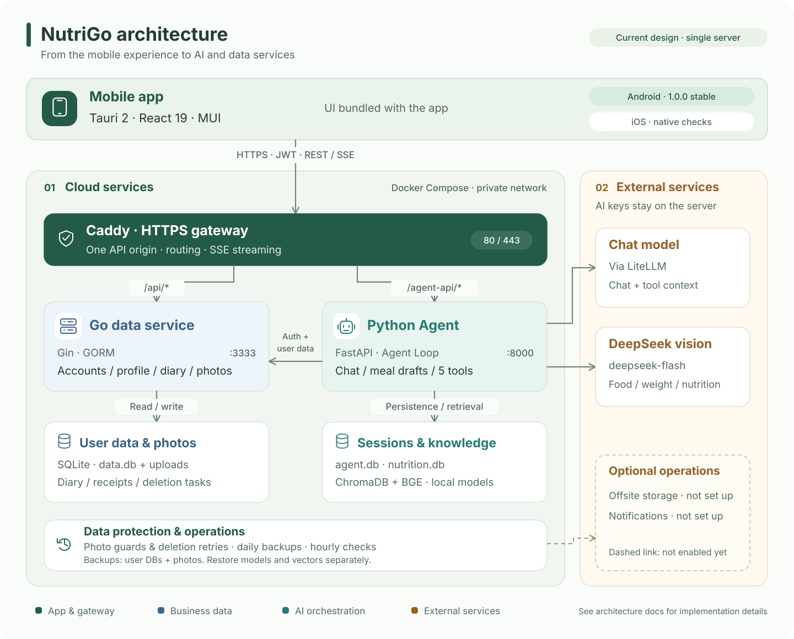

<div align="center">


<h1 align="center">NutriGo — AI Nutrition Assistant</h1>

</div>

<div align="center">

[**English**](README.md) · [简体中文](README.zh-CN.md)

</div>

> Snap a photo of your food, let AI analyze the nutrition, and get personalized dietary advice. A Tauri 2 mobile app with cloud-hosted data and AI services.

<div align="center">

[](backend/)
[](agent/)
[](frontend/)
[](frontend/)
[](LICENSE)

[](https://github.com/Green-hats/NutriGo/actions)
[](https://github.com/Green-hats/NutriGo/releases)
[](https://github.com/Green-hats/NutriGo)

</div>

---

## 📸 Screenshots

<div align="center">

**Live demo · AI chat**


| Login | AI Chat | Food Diary | Nutrition Trend | Health Profile |
| :---: | :---: | :---: | :---: | :---: |
|  |  |  |  |  |

</div>

---

## ✨ Features

- **📷 Photo Analysis** — DeepSeek V4.1 Flash estimates multiple foods, portions and nutrition; edit grams or nutrients, then save the whole meal with retry deduplication
- **🤖 AI Chat** — Agent Loop + 5 tools, SSE streaming output, Markdown, expandable tool results and optional model reasoning
- **📚 RAG Knowledge Base** — ChromaDB with 2,277 entries from a nutrition textbook, answers professional nutrition questions
- **📊 Nutrition Analysis** — 8,407 food nutrition references, gram-based conversion, multi-day trend insights
- **🗓️ Food Diary** — Photo or manual entries by date; meal type defaults to the phone's local time and remains editable, with daily totals and nutrition trends
- **👤 Personalized Profile** — Height/weight, goals, allergies, pre-existing conditions; AI-tailored dietary advice
- **🛡️ Authentication & Access Control** — JWT + refresh-token rotation & logout blacklist, IP rate limiting on auth, internal service token, strict key validation in production
- **💾 Data protection** — Referenced-photo deletion guards, durable cleanup retries, verified local backups, and optional offsite/alert configuration; see the [operations guide](deploy/cloud/README.md).

---

## 🚀 Quick Start

### Android download

[Download Android 1.0.0 APK](https://github.com/Green-hats/NutriGo/releases/download/android-v1.0.0/NutriGo-Android-arm64-1.0.0.apk) · [Release notes and checksums](https://github.com/Green-hats/NutriGo/releases/tag/android-v1.0.0)

ARM64 stable release build for Android 8.0+ with Android System WebView 117+. Android debugging and cleartext HTTP are disabled. Its production package ID differs from the earlier `.debug` test builds, so both can coexist; iOS source and native checks are available, but no IPA or TestFlight release is published yet.

The production API is deployed from commit `6ddfe4d3`. Android 1.0.0 uses `POST /agent-api/chat`, keeping message text out of URLs and access logs. Older test APKs can still use accounts, profiles, diaries and the retained CLIP photo endpoints, but their legacy `GET /chat` client can no longer chat. See the [mobile compatibility table](docs/MOBILE.md#版本兼容性) before testing an older build.

### Requirements

| Tool | Version |
|------|---------|
| Go | 1.26.5+ |
| Python | 3.13 (CI / Docker) |
| Node.js | 24 (CI); minimum 22.12 |
| uv | 0.11+ |

### Installation

```bash
git clone https://github.com/Green-hats/NutriGo.git
cd NutriGo

# Configure LLM API key (supports OpenAI/Gemini/DeepSeek/Ollama via litellm)
cp agent/.env.example agent/.env
# Edit agent/.env and fill in LLM_API_KEY
# Photo analysis uses DeepSeek official: set FOOD_VISION_API_KEY
# or reuse LLM_API_KEY when chat is configured for DeepSeek official

# Start all services with one command
./start.sh
```

The command above starts local services and the browser preview. The product is a **Tauri 2 Android / iOS app**:

```bash
cd frontend
npm run android:dev
# On macOS with Xcode: npm run ios:dev
```

Stop any existing Vite process first to free port 5173. See the [mobile guide](docs/MOBILE.md) for prerequisites, device debugging, API configuration and signing. Local development works before a cloud domain is available.

### Service Layout

| Service | Port | Stack | Responsibility |
|---------|------|-------|----------------|
| `frontend` | App bundle (dev :5173) | Tauri 2 + React 19 + TS | Android / iOS interface |
| `backend` | :3333 | Go + Gin + GORM + SQLite | Users / data / files |
| `agent` | :8000 | FastAPI + litellm + ChromaDB | AI chat / recognition / RAG |

---

## 🏗️ Architecture

[](docs/diagrams/architecture-en.svg)

- **Agent Loop** — the LLM autonomously decides which tool to call; streams model reasoning when the provider returns `reasoning_content`
- **5 Tools** — look up nutrition / get profile / get diet history / get nutrition trends / search knowledge base
- **RAG** — BGE-small-zh embeddings + ChromaDB vector retrieval
- **Multimodal** — DeepSeek V4.1 Flash vision API with nutrition database references; Chinese-CLIP retained for older APKs
- **Meal workflow** — upload a photo → verify ownership → analyze food and nutrition → edit the draft in the app → save all items in one Go transaction. Retrying the same batch does not create duplicate records.
- **Client compatibility** — Android 1.0.0 has the complete current protocol; older APKs retain core data and CLIP flows, while legacy URL-based chat is intentionally disabled

The app preselects breakfast, lunch, dinner or a snack using local time. Users can change it directly; estimated weight ranges and assumptions are tucked into expandable nutrition details. API keys stay on the server, and React assets ship inside the app.

Diet details remain available; referenced photos are protected, while unattached photos expire seven days after upload by default. Local backups and hourly checks run on the server; offsite storage and notification delivery are not configured yet. See [data management](docs/DATA_MANAGEMENT.md). Account deletion / full export and real-data offline sync remain on the [roadmap](docs/ROADMAP.md).

See [`docs/ARCHITECTURE.md`](docs/ARCHITECTURE.md) for detailed design.

---

## 📚 Documentation

| Doc | Description |
|-----|-------------|
| [Mobile app](docs/MOBILE.md) | Android / iOS development, native builds and cloud connection |
| [Cloud deployment](deploy/cloud/README.md) | Caddy HTTPS + Go + Agent on one server |
| [Architecture](docs/ARCHITECTURE.md) | System architecture, data flow, security design |
| [API Reference](backend/API.md) | Go routes, errors, image deletion and batch-save contracts |
| [Backend](docs/backend.md) | Go services, transactions and background tasks |
| [Data management](docs/DATA_MANAGEMENT.md) | Retention, deletion, backup scope and recovery gaps |
| [Resource limits](docs/RESOURCE_LIMITS.md) | Request bounds, photo quotas, disk admission and inference concurrency |
| [Roadmap](docs/ROADMAP.md) | Delivered capabilities, limitations and priorities |
| [Product proposal](docs/PROPOSAL.md) | Product goals and acceptance criteria |
| [Agent Doc](docs/agent.md) | Python Agent design & tool descriptions |
| [Frontend Doc](docs/frontend.md) | React frontend structure |
| [Test Prompts](docs/agent-test-prompts.md) | Agent test prompt suites |

---

## 🧪 Testing

These checks do not require running application services or live models. Install dependencies as described in the [contributing guide](CONTRIBUTING.md) first:

```bash
(cd backend && go test ./internal/... && go vet ./...)
(cd frontend && npm run lint && npm test && npm run build)
(cd agent && uv run ruff check app/ recognition/ tests/ && uv run mypy app/ recognition/ && uv run pytest)
python3 -m unittest discover -s deploy/cloud/backup -p 'test_*.py'
python3 -m unittest discover -s .github/scripts -p 'test_*.py'
```

`make test` also invokes development integration scripts that need services, models or a live LLM; it is neither an isolated unit suite nor every CI check. Go HTTP integration uses a dedicated test database, and Agent integration scripts must not target production. CI additionally checks native code, Android and the gateway; see the contributing guide for full commands and device-validation requirements.

---

## 🛠️ Tech Stack

| Layer | Tech |
|-------|------|
| Mobile app | Tauri 2 · Rust · React 19 · TypeScript (strict) · MUI 9 + Emotion · Zustand · Vite · vitest |
| Agent | Python 3.13 · FastAPI · LiteLLM · httpx / DeepSeek vision API · BGE + ChromaDB · SSE |
| Backend | Go 1.26 · Gin · GORM · SQLite · JWT · bcrypt |
| Quality | Go test · pytest · ruff · mypy · oxlint · vitest · GitHub Actions CI |

---

## 🚀 Deployment

See [cloud deployment](deploy/cloud/README.md). Caddy exposes one HTTPS API origin, while Go and Agent run on the private Compose network. React assets are distributed inside the mobile app. No frontend hosting is required. Server updates, Android Releases and documentation changes are delivered separately; Actions does not currently deploy the server.

---

## 🤝 Contributing

Contributions are welcome! Please check out:

- [Contributing Guide](CONTRIBUTING.md)
- Run the checks relevant to your change in the contributing guide
- Follow the Conventional Commits convention

## 📄 License

This project is open-sourced under the [GPL v3](LICENSE) license.

---

*NutriGo — giving everyone their own AI nutritionist.*
