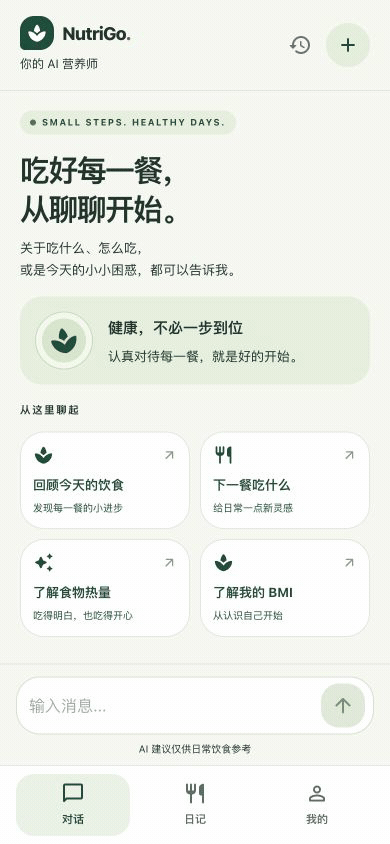
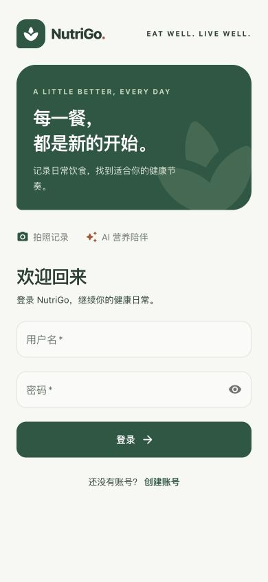
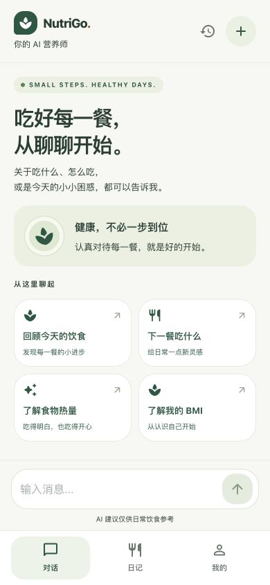
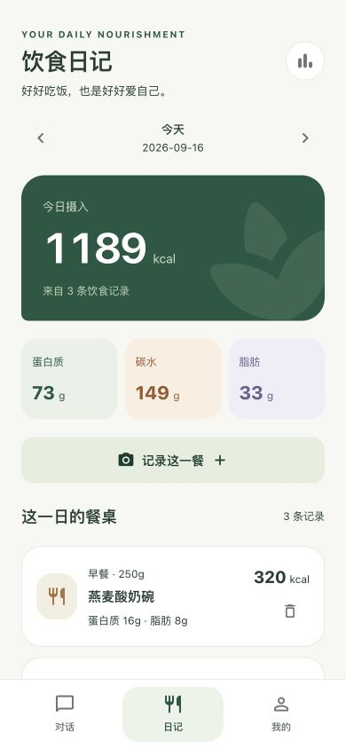
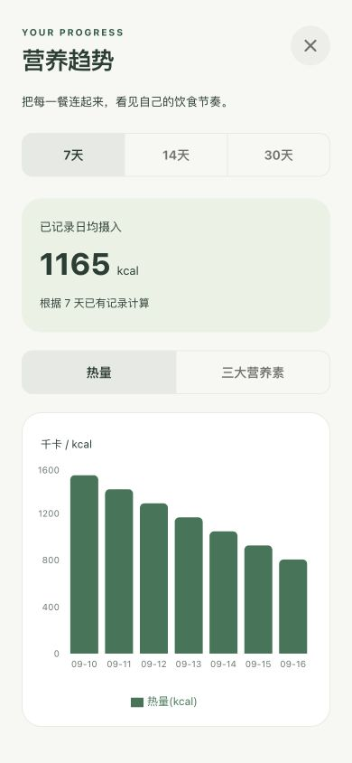
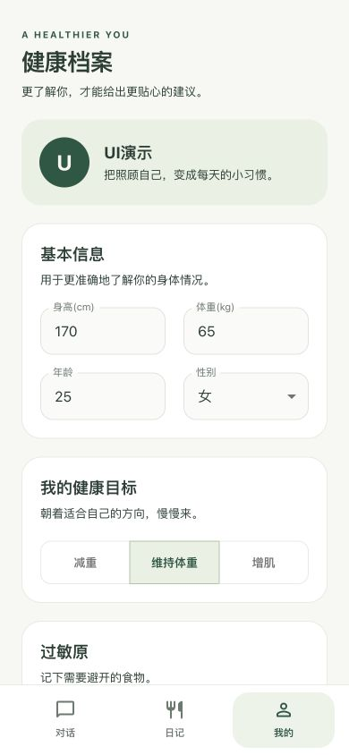
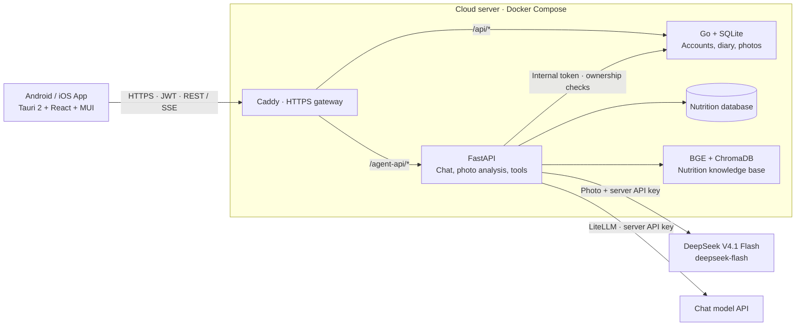

<div align="center">


<h1 align="center">NutriGo — AI Nutrition Assistant</h1>

</div>

<div align="center">

[**English**](README.md) · [简体中文](README.zh-CN.md)

</div>

> Snap a photo of your food, let AI analyze the nutrition, and get personalized dietary advice. A fully-featured full-stack AI nutrition assistant.

<div align="center">

[](backend/)
[](agent/)
[](frontend/)
[](frontend/)
[](LICENSE)

[](https://github.com/Green-hats/NutriGo/actions)
[](https://github.com/Green-hats/NutriGo/releases)
[](https://github.com/Green-hats/NutriGo)

</div>

---

## 📸 Screenshots

<div align="center">

**Live demo · AI chat**



| Login | AI Chat | Food Diary | Nutrition Trend | Health Profile |
| :---: | :---: | :---: | :---: | :---: |
|  |  |  |  |  |

</div>

---

## ✨ Features

- **📷 Photo Analysis** — DeepSeek V4.1 Flash estimates multiple foods, portions and nutrition; edit grams or nutrients, then save the whole meal with retry deduplication
- **🤖 AI Chat** — Agent Loop + 5 tools, SSE streaming output, Markdown + chain-of-thought rendering
- **📚 RAG Knowledge Base** — ChromaDB with 2,277 entries from a nutrition textbook, answers professional nutrition questions
- **📊 Nutrition Analysis** — 8,407 real nutrition data points, precise gram-based calculation, multi-day trend insights
- **🗓️ Food Diary** — Photo or manual entries by date; meal type defaults to the phone's local time and remains editable, with daily totals and nutrition trends
- **👤 Personalized Profile** — Height/weight, goals, allergies, pre-existing conditions; AI-tailored dietary advice
- **🛡️ Authentication & Access Control** — JWT + refresh-token rotation & logout blacklist, IP rate limiting on auth, internal service token, strict key validation in production

---

## 🚀 Quick Start

### Android download

[Download Android 0.1.5 APK](https://github.com/Green-hats/NutriGo/releases/download/android-v0.1.5/NutriGo-Android-arm64-0.1.5.apk) · [Release notes and checksums](https://github.com/Green-hats/NutriGo/releases/tag/android-v0.1.5)

ARM64 test build, about **16.1 MiB**, for Android 8.0+ with Android System WebView 117+. It connects to the configured cloud API and can update earlier Release installations using the same signing identity. iOS source and native checks are available; no IPA or TestFlight release is published yet.

### Requirements

| Tool | Version |
|------|---------|
| Go | 1.26+ |
| Python | 3.13+ |
| Node.js | 22+ |
| uv | 0.11+ |

### Installation

```bash
git clone https://github.com/Green-hats/NutriGo.git
cd NutriGo

# Configure LLM API key (supports OpenAI/Gemini/DeepSeek/Ollama via litellm)
cp agent/.env.example agent/.env
# Edit agent/.env and fill in LLM_API_KEY
# Photo analysis uses DeepSeek official: set FOOD_VISION_API_KEY
# or reuse LLM_API_KEY when chat is configured for DeepSeek official

# Start all services with one command
./start.sh
```

The command above starts local services and the browser preview. The product is a **Tauri 2 Android / iOS app**:

```bash
cd frontend
npm run android:dev
# On macOS with Xcode: npm run ios:dev
```

Stop any existing Vite process first to free port 5173. See the [mobile guide](docs/MOBILE.md) for prerequisites, device debugging, API configuration and signing. Local development works before a cloud domain is available.

### Service Layout

| Service | Port | Stack | Responsibility |
|---------|------|-------|----------------|
| `frontend` | App bundle (dev :5173) | Tauri 2 + React 19 + TS | Android / iOS interface |
| `backend` | :3333 | Go + Gin + GORM + SQLite | Users / data / files |
| `agent` | :8000 | FastAPI + litellm + ChromaDB | AI chat / recognition / RAG |

---

## 🏗️ Architecture



- **Agent Loop** — the LLM autonomously decides which tool to call; streams chain-of-thought (`reasoning_content`)
- **5 Tools** — look up nutrition / get profile / get diet history / get nutrition trends / search knowledge base
- **RAG** — BGE-small-zh embeddings + ChromaDB vector retrieval
- **Multimodal** — DeepSeek V4.1 Flash vision API with nutrition database references; Chinese-CLIP retained for older APKs
- **Meal workflow** — upload a photo → verify ownership → analyze food and nutrition → edit the draft in the app → save all items in one Go transaction. Retrying the same batch does not create duplicate records.

The app preselects breakfast, lunch, dinner or a snack using local time. Users can change it directly; estimated weight ranges and assumptions are tucked into expandable nutrition details. API keys stay on the server, and React assets ship inside the app.

See [`docs/ARCHITECTURE.md`](docs/ARCHITECTURE.md) for detailed design.

---

## 📚 Documentation

| Doc | Description |
|-----|-------------|
| [Mobile app](docs/MOBILE.md) | Android / iOS development, native builds and cloud connection |
| [Cloud deployment](deploy/cloud/README.md) | Caddy HTTPS + Go + Agent on one server |
| [Architecture](docs/ARCHITECTURE.md) | System architecture, data flow, security design |
| [API Reference](backend/API.md) | All Go backend endpoints |
| [Agent Doc](docs/agent.md) | Python Agent design & tool descriptions |
| [Frontend Doc](docs/frontend.md) | React frontend structure |
| [Test Prompts](docs/agent-test-prompts.md) | Agent test prompt suites |

---

## 🧪 Testing

```bash
# Unit tests (no services required, CI-friendly)
make test-go-unit        # Go unit tests
make test-frontend       # Frontend vitest: store / components / mobile API transport
make test-agent-unit     # Agent pytest: no LLM / models

# Integration tests (services must be running)
make test-backend        # Go HTTP API integration tests
make test-agent          # Agent basics: 20 cases
make test-identify       # Image recognition: 13 cases
make test-prompts        # Full prompts: --quick 9 core cases

# Run everything
make test
```

**Static analysis:** `make lint` (ruff + mypy + oxlint) · `make typecheck` (mypy type checking)

---

## 🛠️ Tech Stack

| Layer | Tech |
|-------|------|
| Mobile app | Tauri 2 · Rust · React 19 · TypeScript (strict) · MUI 9 + Emotion · Zustand · Vite · vitest |
| Agent | Python 3.13 · FastAPI · LiteLLM · httpx / DeepSeek vision API · BGE + ChromaDB · SSE |
| Backend | Go 1.26 · Gin · GORM · SQLite · JWT · bcrypt |
| Quality | Go test · pytest · ruff · mypy · oxlint · vitest · GitHub Actions CI |

---

## 🚀 Deployment

See [cloud deployment](deploy/cloud/README.md). Caddy exposes one HTTPS API origin, while Go and Agent run on the private Compose network. React assets are distributed inside the mobile app. No frontend hosting is required.

---

## 🤝 Contributing

Contributions are welcome! Please check out:

- [Contributing Guide](CONTRIBUTING.md)
- Run `make lint && make test` before submitting
- Follow the Conventional Commits convention

## 📄 License

This project is open-sourced under the [GPL v3](LICENSE) license.

---

*NutriGo — giving everyone their own AI nutritionist.*
