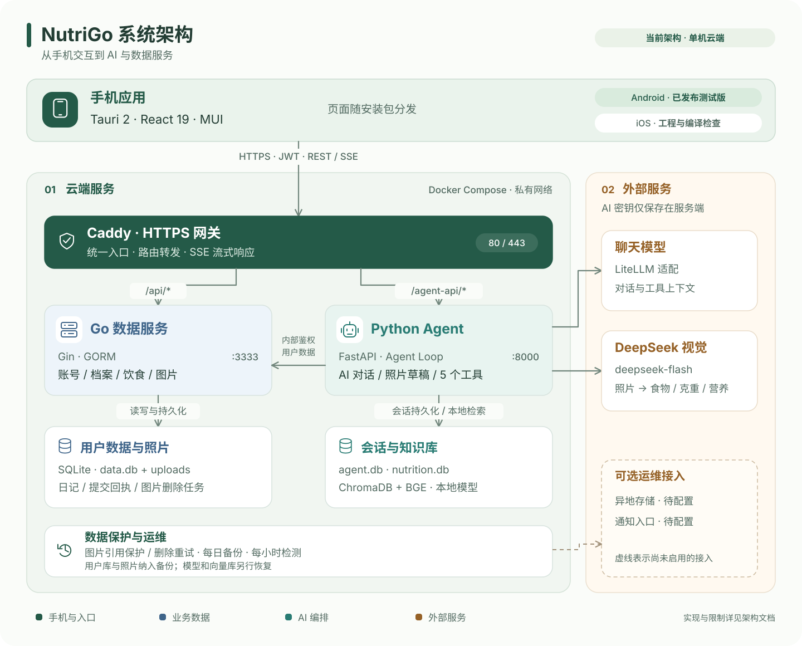

<div align="center">


<h1 align="center">NutriGo — AI 智能营养师</h1>

</div>

<div align="center">

[**English**](README.md) · [简体中文](README.zh-CN.md)

</div>

> 拍照识别食物，AI 分析营养，个性化膳食建议。基于 Tauri 2 手机 App 与云端数据、AI 服务构建。

<div align="center">

[](backend/)
[](agent/)
[](frontend/)
[](frontend/)
[](LICENSE)

[](https://github.com/Green-hats/NutriGo/actions)
[](https://github.com/Green-hats/NutriGo/releases)
[](https://github.com/Green-hats/NutriGo)

</div>

---

## 📸 截图演示

<div align="center">

**AI 聊天 Live demo**


| 登录 | AI 对话 | 饮食日记 | 营养趋势 | 健康档案 |
| :---: | :---: | :---: | :---: | :---: |
|  |  |  |  |  |

</div>

---

## ✨ 功能特性

- **📷 拍照分析** — DeepSeek V4.1 Flash 估算多种食物、份量及营养，修改克重或营养值后整餐保存，重试不会重复记录
- **🤖 AI 对话** — Agent Loop + 5 个工具，SSE 流式实况输出，Markdown、可展开工具详情与可选模型分析过程
- **📚 RAG 知识库** — ChromaDB 2277 条《营养学》教材文档，回答专业营养问题
- **📊 营养分析** — 8407 条食物营养参考数据，按克数换算，多日趋势洞察
- **🗓️ 饮食日记** — 按日期拍照或手动录入，按手机本地时间默认选中餐次并允许修改，展示每日合计与营养趋势
- **👤 个性化档案** — 身高体重/目标/过敏原/基础病，AI 定制饮食建议
- **🛡️ 认证与访问控制** — JWT + 刷新令牌轮换与登出黑名单、认证接口 IP 限流、内部服务鉴权、生产环境密钥强制校验
- **💾 数据保护** — 关联照片删除保护、持久化清理重试、可恢复验证的本地备份，以及可选异地存储和告警接入；见[运维说明](deploy/cloud/README.md)。

---

## 🚀 快速开始

### Android 下载

[下载 Android 0.1.6 APK](https://github.com/Green-hats/NutriGo/releases/download/android-v0.1.6/NutriGo-Android-arm64-0.1.6.apk) · [更新说明与校验文件](https://github.com/Green-hats/NutriGo/releases/tag/android-v0.1.6)

ARM64 测试包约 **16.1 MiB**，要求 Android 8.0+、Android System WebView 117+。安装包连接已配置的云端 API，沿用同一签名，可覆盖此前 Release 版本。iOS 已有源码和原生检查，尚未发布 IPA / TestFlight。

### 环境要求

| 工具 | 版本 |
|------|------|
| Go | 1.26.5+ |
| Python | 3.13（CI / Docker） |
| Node.js | 24（CI）；最低 22.12 |
| uv | 0.11+ |

### 安装

```bash
git clone https://github.com/Green-hats/NutriGo.git
cd NutriGo

# 配置 LLM API Key（支持 OpenAI/Gemini/DeepSeek/Ollama 等，通过 litellm）
cp agent/.env.example agent/.env
# 编辑 agent/.env 填入 LLM_API_KEY
# 拍照分析使用 DeepSeek 官方：配置 FOOD_VISION_API_KEY
# 聊天已配置为 DeepSeek 官方时，也可复用 LLM_API_KEY

# 一键启动全部服务
./start.sh
```

以上命令用于本地服务与浏览器预览。手机 App 使用 **Tauri 2**，同时支持 Android 和 iOS：

```bash
cd frontend
npm run android:dev
# macOS / Xcode 环境也可运行 npm run ios:dev
```

运行手机开发命令前停止已有的 Vite 进程，避免占用 5173。工具链、真机调试、API 地址和签名配置见 [手机 App 文档](docs/MOBILE.md)；无域名时可先本地开发。

### 服务架构

| 服务 | 端口 | 技术栈 | 职责 |
|------|------|--------|------|
| `frontend` | 安装包（开发 :5173） | Tauri 2 + React 19 + TS | Android / iOS 界面 |
| `backend` | :3333 | Go + Gin + GORM + SQLite | 用户/数据/文件 |
| `agent` | :8000 | FastAPI + litellm + ChromaDB | AI 对话/识别/RAG |

---

## 🏗️ 架构

[](docs/diagrams/architecture-zh.svg)

- **Agent Loop** — LLM 自主决定调用工具，仅在模型返回 `reasoning_content` 时推送分析过程
- **5 个工具** — 查营养 / 查档案 / 查饮食记录 / 查营养趋势 / 搜知识库
- **RAG** — BGE-small-zh 嵌入 + ChromaDB 向量检索
- **多模态** — DeepSeek V4.1 Flash 图片分析与营养库参考值；保留旧 APK 的 Chinese-CLIP 接口
- **整餐记录** — 上传照片 → 核验归属 → 分析食物与营养 → 在 App 修改草稿 → Go 事务统一保存；同一批次重试不会重复入账。

App 按本地时间默认选中早餐、午餐、晚餐或加餐，用户可直接切换；估重范围和假设收进可展开的营养详情。API Key 仅保留在服务器，React 页面随安装包分发。

饮食明细持续保留；被引用照片受删除保护，未关联照片默认按上传时间 7 天清理。服务器已运行本地备份和每小时检测，异地存储与通知接收端尚未配置；详见[数据管理](docs/DATA_MANAGEMENT.md)。当前没有账号注销 / 完整导出或真实数据离线同步，后续工作见[路线图](docs/ROADMAP.md)。

详细设计见 [`docs/ARCHITECTURE.md`](docs/ARCHITECTURE.md)。

---

## 📚 文档

| 文档 | 内容 |
|------|------|
| [手机 App](docs/MOBILE.md) | Android / iOS 开发、原生打包与云端连接 |
| [云端部署](deploy/cloud/README.md) | Caddy HTTPS + Go + Agent 单机部署 |
| [架构设计](docs/ARCHITECTURE.md) | 系统架构、数据流、安全设计 |
| [API 文档](backend/API.md) | Go 路由、错误、照片删除与批量保存契约 |
| [后端文档](docs/backend.md) | Go 服务、事务与后台任务 |
| [数据管理](docs/DATA_MANAGEMENT.md) | 保留规则、删除语义、备份范围与恢复缺口 |
| [路线图](docs/ROADMAP.md) | 已交付能力、当前限制与后续优先级 |
| [产品方案](docs/PROPOSAL.md) | 产品目标与验收标准 |
| [Agent 文档](docs/agent.md) | Python Agent 设计与工具说明 |
| [前端文档](docs/frontend.md) | React 前端结构 |
| [测试说明](docs/agent-test-prompts.md) | Agent 测试提示词集 |

---

## 🧪 测试

以下检查无需启动业务服务或调用真实模型；先按[贡献指南](CONTRIBUTING.zh-CN.md)安装依赖：

```bash
(cd backend && go test ./internal/... && go vet ./...)
(cd frontend && npm run lint && npm test && npm run build)
(cd agent && uv run ruff check app/ recognition/ tests/ && uv run mypy app/ recognition/ && uv run pytest)
python3 -m unittest discover -s deploy/cloud/backup -p 'test_*.py'
python3 -m unittest discover -s .github/scripts -p 'test_*.py'
```

`make test` 还包含需要服务、模型或真实 LLM 的开发集成脚本，并不等于纯单测或全部 CI。Go HTTP 集成测试使用独立测试库；Agent 在线脚本不可直接针对生产执行。CI 另做原生、Android 和网关检查；完整命令与真机验收要求见贡献指南。

---

## 🛠️ 技术栈

| 层 | 技术 |
|----|------|
| 手机 App | Tauri 2 · Rust · React 19 · TypeScript (strict) · MUI 9 + Emotion · Zustand · Vite · vitest |
| Agent | Python 3.13 · FastAPI · LiteLLM · httpx / DeepSeek 视觉 API · BGE + ChromaDB · SSE |
| 后端 | Go 1.26 · Gin · GORM · SQLite · JWT · bcrypt |
| 质量 | Go test · pytest · ruff · mypy · oxlint · vitest · GitHub Actions CI |

---

## 🚀 部署

使用[云端部署指南](deploy/cloud/README.md)。Caddy 提供 HTTPS，Go 和 Agent 运行在私有 Compose 网络。服务端升级、Android Release 和文档更新分别交付；当前 Actions 不自动部署服务器。

---

## 🤝 贡献

欢迎贡献！请参考：

- [贡献指南](CONTRIBUTING.zh-CN.md)
- 提交前执行贡献指南中与改动相关的检查
- 遵循 Conventional Commits 规范

## 📄 许可证

本项目基于 [GPL v3](LICENSE) 许可证开源。

---

*NutriGo — 让每个人都拥有自己的 AI 营养师。*
