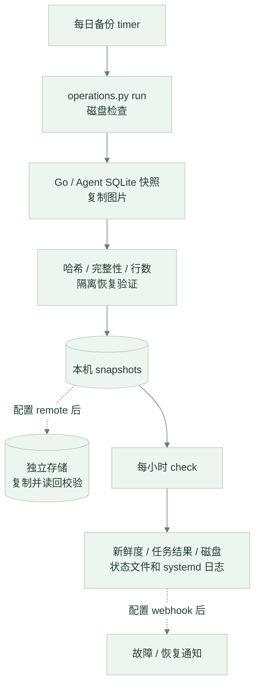

# 云端部署与恢复架构

更新日期：2026-09-18。本文聚焦当前单机云端拓扑；系统设计见[架构文档](../../docs/ARCHITECTURE.md)，执行步骤见[云端部署](../cloud/README.md)。旧网页部署已不再作为当前产品入口，迁移边界见[部署索引](../README.md#从旧网页部署迁移)。

## 请求路径

Caddy 对外提供 80 / 443；Go 和 Agent 只暴露在 Compose 网络中。`/api/internal/*`、图片内部读取及 `/api/metrics` 等路径被公网网关阻断。API Key 仅由服务端使用，手机携带用户 JWT。当前照片识别固定调用 DeepSeek，教材向量检索在服务器本地执行。

新照片流程为上传 → 归属校验 → 多模态草稿 → 用户修正 → Go 批量事务保存。旧版 CLIP 接口继续提供兼容；它不代表当前 App 仍走候选菜名选择流程。

## 持久化

下表使用 Compose 逻辑卷名，实际 Docker 卷名通常带项目名前缀。更新服务必须保留原项目和卷映射。

| 卷 | 容器路径 | 数据及恢复来源 |
|---|---|---|
| `backend-data` | `/data` | `data.db`、`uploads/`；用户数据快照 |
| `agent-data` | `/app/agent/data` | `agent.db`；用户数据快照 |
| `chroma-data` | `/app/agent/chroma_db` | 教材数据库与索引；仓库完整快照 |
| `model-data` | `/models` | BGE / 兼容 CLIP 权重；固定模型版本 |
| `caddy-data`、`caddy-config` | `/data`、`/config`（Caddy） | TLS 和运行状态；单独管理 |

[用户数据生命周期](../../docs/DATA_MANAGEMENT.md)定义照片关联保护、删除队列和未关联清理。日记明细长期保留，汇总查询不会定期删除原始记录。文件删除任务保存在 Go 数据库中，可跨重启继续处理。

## 备份与检测

默认保留 14 份已验证本地快照；启用异地存储时，远端读回成功后才执行本地保留策略。远端失败不删旧本地快照，远端历史由独立存储设置保留期。两个 SQLite 分别一致，不保证跨库同一时刻；恢复生产须停写并保全现有数据。

目前已运行本机备份和每小时检测，尚未配置独立存储及通知接收端。模型、向量库、TLS 和部署凭据不包含在用户数据快照中；整机故障需要外部监控，不能依赖主机自身通知。

## 发布与扩展边界

当前是单实例部署。Agent 缓存、会话锁、并发计数与认证限流为进程内状态，增加副本需要另行设计共享存储和分布式协调。SQLite、磁盘容量及模型常驻内存应按实际负载观测，不以旧文档中的固定耗时或内存估算作为容量承诺。

CI 校验 Go、Python、前端、原生配置、Android APK 和网关；Android Release 负责签名发布安装包，不会部署服务器。云端变更仍需单独备份、更新、业务验收和恢复准备，具体命令集中维护在[云端指南](../cloud/README.md)。
