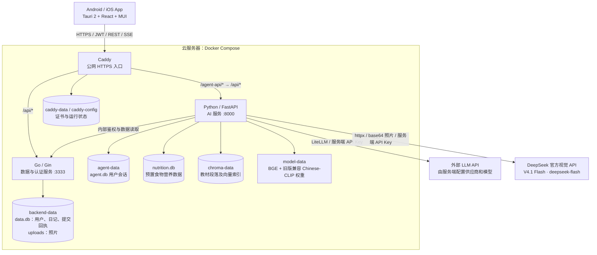
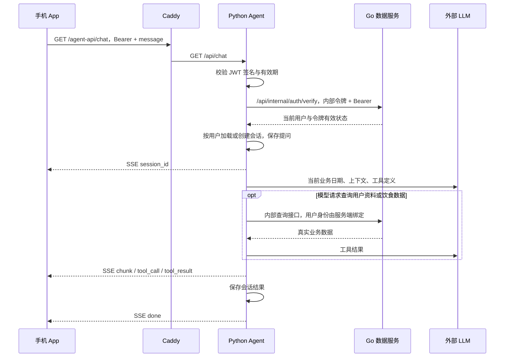
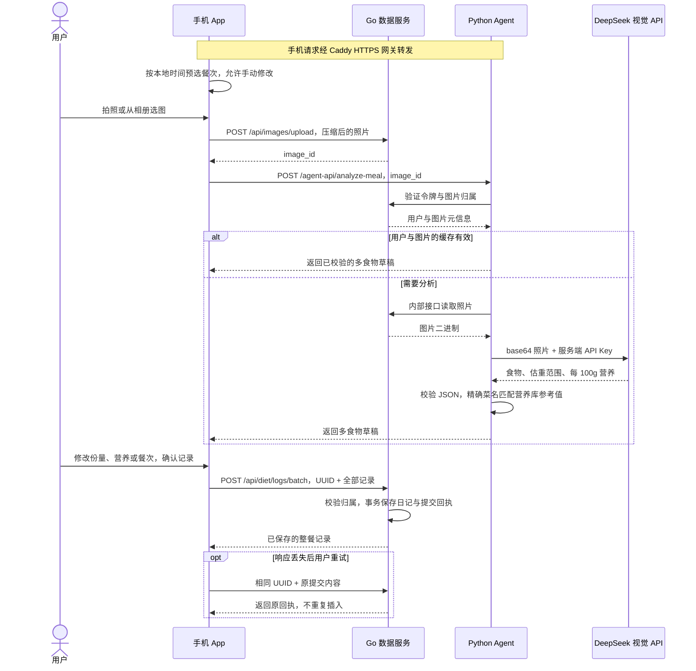
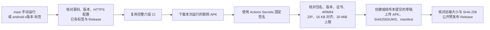

# NutriGo — 架构设计文档

更新日期：2026-09-18。本文描述 Android 0.1.6 的 DeepSeek 照片分析实现；发布状态以 GitHub Release 为准。尚未实现的改进单独列于末节。

移动端运行与签名见 [MOBILE.md](MOBILE.md)，云端部署、模型准备和恢复操作见 [部署说明](../deploy/cloud/README.md)。具体配置和接口以本文链接的源码为准。

## 一、系统形态与交付边界

NutriGo 是 **Tauri 2 手机 App + 单机云端服务**。React 页面、样式与静态资源打进安装包；Caddy 提供 HTTPS API 入口，云端不托管手机页面。Vite 浏览器界面用于开发预览。

| 部分 | 当前实现与交付状态 |
|---|---|
| Android | 已发布 [0.1.6 ARM64 测试 APK](https://github.com/Green-hats/NutriGo/releases/tag/android-v0.1.6)，约 16.1 MiB；要求 Android 8.0+、WebView 117+；GitHub Actions 自动签名和 Release 发布已跑通 |
| iOS | 已有原生工程，最低 iOS 17；CI 检查 iOS Rust 目标，尚无自动签名、IPA / TestFlight 发布流程 |
| 数据服务 | Go 管理账号、健康档案、饮食记录、汇总、图片和令牌状态 |
| AI 服务 | Python 管理用户会话和工具编排；调用外部 LLM，执行云端照片识别和 RAG 检索 |
| 离线能力 | 正常 App 有断网提示和错误恢复；独立 preview 包展示模拟数据。尚无真实数据离线缓存与自动同步 |

Android Release 使用现有测试签名和 `com.greenhats.nutrigo.debug` 包名，以兼容已安装测试版；这不代表已完成应用商店正式发布。

## 二、整体架构



只有网关公开 80 / 443；Go 和 Agent 在 Compose 内网通信。图片、用户数据库、会话、向量库、模型与证书分别持久化；重建容器不等于重建这些卷。配置见 [compose.yml](../deploy/cloud/compose.yml)。

## 三、技术栈与职责

| 层 | 技术与职责 |
|---|---|
| 手机端 | Tauri 2 / Rust、React 19、TypeScript、Vite、MUI 9 + Emotion、Zustand、React Router；负责交互、图片压缩、流式展示和连接状态 |
| 原生通信 | `@tauri-apps/plugin-http` 发起 App 网络请求；浏览器开发预览使用标准 `fetch` 与 Vite 代理 |
| Go | Gin / GORM / SQLite / JWT / bcrypt；负责业务数据的写入、归属校验、认证与图片生命周期 |
| Python | FastAPI / LiteLLM / aiosqlite / httpx；负责 Agent Loop、工具调用与用户会话持久化 |
| 识别与检索 | DeepSeek V4.1 Flash 远程视觉 API、营养库参考值、BGE-small-zh、ChromaDB；旧版兼容接口保留 Chinese-CLIP，权重不进入 APK |
| 云端入口 | Caddy HTTPS、路径路由和 SSE 转发；支持域名证书和单独的公网 IP 证书配置 |
| 交付 | GitHub Actions CI、Android APK 优化构建、固定签名、GitHub 预发布 Release |

Python **保存用户聊天会话及工具结果**，但不直接写 Go 的账号、档案或饮食记录数据库。当前 Agent 工具以查询为主，饮食记录由 App 确认后调用 Go 接口保存。LLM API Key 只在服务端使用。

## 四、网络与错误处理

### 4.1 路径与认证

| 调用方 | 对外路径或服务地址 | 转发和认证 |
|---|---|---|
| App → Go | `HTTPS_ORIGIN/api/*` | Caddy 转发至 Go；用户业务接口携带 `Authorization: Bearer ...` |
| App → Agent | `HTTPS_ORIGIN/agent-api/*` | Caddy 改写为 Agent 的 `/api/*`；用户接口携带同一访问令牌 |
| Agent → Go | `http://backend:3333/api/*` | `X-Internal-Token`；令牌校验接口另外携带用户 Bearer 令牌 |
| Agent → LLM | 服务端配置的模型 API 地址 | 服务端 `LLM_API_KEY`，不经手机中转 |
| Agent → 视觉模型 | `https://api.deepseek.com/chat/completions` | `FOOD_VISION_API_KEY`；符合官方端点条件时可复用 `LLM_API_KEY` |

App 的 API 源由构建时 `VITE_API_BASE_URL` 决定，正式构建要求 HTTPS；修改地址需要重新打包。当前原生 HTTP capability 允许 HTTPS 请求，具体请求源由 API 封装决定。源码见 [config.ts](../frontend/src/api/config.ts)、[http.ts](../frontend/src/api/http.ts) 和 [capabilities](../frontend/src-tauri/capabilities/default.json)。

网关只放行业务路由；`/api/internal/*`、图片元信息/二进制读取和 `/api/metrics` 不对公网开放。具体白名单见 [Caddyfile](../deploy/cloud/Caddyfile) 与 [IP 证书配置](../deploy/cloud/Caddyfile.ip)。

### 4.2 REST 与 SSE

对话使用 **fetch + ReadableStream 解析 SSE**，并非浏览器 `EventSource`。因此可以携带 Authorization 请求头，并通过 `AbortController` 取消请求。Go 请求默认 20 秒，Agent 请求及对话默认 60 秒超时；超时覆盖连接和每次响应体读取，流式数据到达后重新计算读取等待时间。

SSE 事件包括 `session_id`、`chunk`、`thinking`、`tool_call`、`tool_result`、`done`、`error`。是否出现 thinking 内容取决于模型及服务端配置。前端保留 Markdown 空白，单波浪号数值范围不作为删除线解析。实现见 [sse.ts](../frontend/src/api/sse.ts) 和 [Chat.tsx](../frontend/src/pages/Chat.tsx)。

- 401 会尝试轮换刷新令牌并重试一次；断网、超时或暂时服务故障不会直接清空登录态。
- 切换账号会使旧请求失效，避免旧响应写入新账号界面。
- 离开聊天页面会取消当前流；服务端检测连接断开后取消本次 Agent 任务并释放并发名额。
- 未收到 `done` / `error` 就结束的流提示回复可能不完整。当前没有 SSE 自动重连或跨连接续传。
- 保存失败保留当前表单，恢复网络后由用户重试；照片整餐保存使用提交 UUID 防重，其余写接口没有通用去重机制。尚无持久化待同步队列。

## 五、核心数据流

### 5.1 AI 对话与用户数据工具



工具注册和用户身份绑定见 [tools.py](../agent/app/tools.py)。当前五项工具为：食物营养查询、健康档案查询、饮食明细查询、多日营养汇总查询、营养知识检索。模型不能自行指定另一用户身份。

Agent 默认限制单条提问长度、工具执行时间、循环轮数、上下文消息数和 token 预算；长会话按用户轮次裁剪发送给模型的上下文，数据库仍保存完整历史。默认同一用户同时最多一个活跃对话。配置见 [config.py](../agent/app/config.py)，上下文处理见 [conversation.py](../agent/app/conversation.py)。

业务日期通过 `APP_TIMEZONE` 显式计算，默认 `Asia/Shanghai`；每次发给模型时重新渲染“今天”，恢复旧会话和跨午夜也使用当前业务日期。App 日记默认日期及餐次使用手机本地时间，用户可手动修改；目前没有按用户保存时区的机制。

### 5.2 拍照识别与记账



1. 用户先选择记录日期；手机按当前本地时间默认选中餐次，用户可手动修改，后续时钟变化不会覆盖选择。
2. 选图后前端压缩为 JPEG，最长边 1600px；上传至 `POST /api/images/upload`。Go 验证格式与大小、生成 UUID 文件名，保存文件和图片元信息，返回 `{id, filename, mime_type, size}`。
3. 新版 App 调用 `POST /agent-api/analyze-meal`，提交 `image_id`。Agent 实时校验登录、向 Go 核验图片归属，再读取缓存或图片。照片通过内联 base64 发往 DeepSeek 官方端点，不公开图片 URL。
4. DeepSeek V4.1 Flash（API 名称 `deepseek-flash`）返回最多 12 项食物的菜名、估重及范围、每 100g 营养和估算假设。后端验证完整 JSON、有限非负营养数值、重量范围和上限；截断或不合规输出返回错误，无食物照片返回空清单。精确菜名命中营养库时采用库中参考值，否则标为 AI 估算。
5. 用户可逐项调整实际食用克数、移除误识别项、修改名称及每 100g 营养；前端即时按克数重算，选择餐次后确认。估重范围及假设收纳在可展开的营养详情中。结果只是一份草稿，不自动写入日记。
6. App 调用 `POST /api/diet/logs/batch`，提交 UUID 和 1–12 条记录。Go 校验全部输入及每张照片归属，用一个事务创建记录和提交回执。同一用户、同一编号和相同内容重试返回原回执，不重复插入；编号相同但内容不同返回 409。超时后 App 保留原提交并锁定编辑，允许重试；关闭后刷新日记。回执随数据库备份，目前未自动清理。

餐次按手机本地小时预选：05:00–09:59 早餐，10:00–14:59 午餐，15:00–20:59 晚餐，其余为加餐。拍照、识别、确认及转手动录入均保留用户选择；编辑已有记录时沿用原餐次。界面保留四个餐次选项，已移除“按当前时间选择”按钮及重复说明，照片流程统一使用“记录这一餐”标题。

前端见 [MealAnalysisFlow.tsx](../frontend/src/components/diary/MealAnalysisFlow.tsx)，压缩见 [foodImage.ts](../frontend/src/lib/foodImage.ts)，Agent 见 [meal_analysis.py](../agent/app/meal_analysis.py) 与 [meal.py](../agent/recognition/meal.py)，原子保存见 [diet_batch.go](../backend/internal/handler/diet_batch.go)。

新版视觉请求固定发送至 `https://api.deepseek.com/chat/completions`，`FOOD_VISION_API_KEY` 可单独配置；聊天配置指向 DeepSeek 官方时可复用 `LLM_API_KEY`，不会把其他供应商密钥转发到 DeepSeek。模型别名可能随供应商升级。照片分析单次总时限 48 秒，同一用户最多一个未完成分析，单进程最多四个；结果缓存一小时、最多 500 张，每次命中前仍校验图片归属。这些限制不是跨副本限额。

旧 APK 继续调用 `/identify-food` 的 Chinese-CLIP Top-5 接口及 `/calculate-intake`，默认克重仍来自食物分类。新流程需要升级 APK。照片估重、隐藏配料和用油均存在误差；范围由模型估计，不是统计置信区间，尚无称重样本集准确率评测。

### 5.3 RAG 检索

知识库使用仓库提供的 `agent/chroma_db/` 快照，集合为 `nutrition_textbook`，含 2,277 条教材段落及 512 维 BGE 向量。部署时将经过校验的同一份数据库与索引恢复到 `chroma-data`，嵌入模型版本必须与已有向量匹配。

当前检索取前三段；明确指定维生素时先增加正文名称过滤，降低相近名称混淆。工具每段最多提供 300 字，返回资料编号与文本。当前尚未返回结构化章节/页码来源，也没有通用相关度阈值或重排模型。知识库不可用或无结果时返回明确提示。实现见 [rag.py](../agent/recognition/rag.py)。

## 六、API 概览

以下为服务内部路由。Go 公网前缀仍为 `/api`；Agent 的公网前缀是 `/agent-api`。完整 Go 契约见 [backend/API.md](../backend/API.md)。

### 6.1 Go :3333

| 方法 | 路径 | 说明 | 认证 / 公网可达性 |
|---|---|---|---|
| GET | `/api/health`、`/api/ready` | 存活、数据库就绪 | 无认证，网关放行 |
| GET | `/api/metrics` | 请求数、状态码等指标 | 服务内无认证，网关阻断 |
| POST | `/api/auth/register`、`/api/auth/login`、`/api/auth/refresh` | 注册、登录、刷新令牌 | 无 Bearer 要求，IP 限流 |
| POST | `/api/auth/logout` | 吊销访问令牌和可选刷新令牌 | JWT |
| GET / PUT | `/api/users/:id/profile` | 查看、更新自己的档案 | JWT + 用户归属 |
| POST | `/api/images/upload` | 上传图片 | JWT |
| DELETE | `/api/images/:id` | 删除自己的未关联图片 | JWT + 用户归属 |
| POST / GET | `/api/diet/logs` | 创建、按日期查询明细 | JWT |
| POST | `/api/diet/logs/batch` | 原子保存多项食物、提交编号防重 | JWT + 图片归属 |
| PUT / DELETE | `/api/diet/logs/:id` | 编辑、删除自己的明细 | JWT + 用户归属 |
| GET | `/api/diet/summaries` | 日期区间汇总、分页 | JWT |
| GET | `/api/internal/auth/verify` | 实时检查访问令牌与用户状态 | 内部令牌 + JWT，网关阻断 |
| GET | `/api/internal/users/:id/profile` | Agent 查询档案 | 内部令牌，网关阻断 |
| GET | `/api/internal/diet/logs`、`/api/internal/diet/summaries` | Agent 查询明细、汇总 | 内部令牌，网关阻断 |
| GET | `/api/images/:id`、`/api/images/:id/data` | 图片归属元信息、二进制 | 内部令牌，网关阻断 |

内部查询具有服务级权限，用户隔离由 Agent 先绑定用户身份或核对图片归属实现。路由注册见 [main.go](../backend/cmd/server/main.go)。

### 6.2 Agent :8000

| 方法 | 内部路径 | 说明 | 认证 |
|---|---|---|---|
| GET | `/api/health`、`/api/ready` | 存活、会话数据库就绪 | 无 |
| GET | `/api/chat?message=&session_id=` | 提问并建立 SSE 流 | JWT + Go 实时校验 |
| GET | `/api/sessions`、`/api/sessions/:id` | 会话列表、历史 | JWT + 会话归属 |
| POST | `/api/sessions/:id/regenerate` | 重新生成最后回复，返回 SSE | JWT + 会话归属 |
| DELETE / PATCH | `/api/sessions/:id` | 删除、重命名会话 | JWT + 会话归属 |
| POST | `/api/analyze-meal` | DeepSeek 多食物与克重营养估算 | JWT + 图片归属 |
| POST | `/api/identify-food` | 旧版 CLIP 兼容接口 | JWT + 图片归属 |
| POST | `/api/calculate-intake` | 按食物和克数计算营养 | JWT |

所有受保护 Agent 路由使用 [auth.py](../agent/app/auth.py) 的实时令牌校验，Go 不可达时拒绝受保护请求。`/ready` 仅检查数据库连通，不代表 LLM、RAG 或识别质量验收已通过。

## 七、数据模型与持久化

### 7.1 Go 用户数据

GORM 启动时通过 `AutoMigrate` 建表；模型定义是结构来源，目前没有独立的版本化迁移流水线。

| 表 | 内容与约束 |
|---|---|
| `users` | 用户名唯一、bcrypt 密码哈希 |
| `user_profiles` | 每用户一份档案；身高、体重、目标、过敏原、饮食习惯、基础病 |
| `food_diaries` | 日期字符串、四类餐次、食物、份量、营养、备注、可空图片关联；长期保留明细 |
| `diet_batches` | 用户与提交 UUID 唯一键、内容哈希及保存回执；防止超时重试重复入账 |
| `food_images` | 用户归属、UUID 文件名、文件路径、MIME 类型和字节大小；文件在 uploads 目录 |
| `daily_summaries` | 保留旧版本已删除明细对应的历史汇总基数，不再定时写入新汇总 |
| `refresh_tokens` | 刷新令牌的 SHA-256 哈希、用户、令牌家族、有效期和吊销时间 |
| `blacklisted_tokens` | 已吊销访问令牌的 jti、用户和有效期 |

汇总查询实时叠加现存明细与旧历史基数，并标识 `live` / `aggregated` / `mixed` 来源；补记、编辑、删除后即时反映变化。旧版本已经删除的明细无法由汇总反推，只能从旧备份恢复。实现见 [summary.go](../backend/internal/handler/summary.go)。

后台任务仅清理过期令牌及超期、未关联日记的图片；当前不存在记录聚合删除任务。未关联图片默认保留 7 天，可通过 `UNATTACHED_IMAGE_RETENTION_DAYS` 调整，设为 0 关闭自动清理。

### 7.2 Agent 数据与资源

| 数据 | 存储位置与用途 |
|---|---|
| 用户会话 | `agent.db` 的 `sessions` 表：用户归属、名称、系统提示词、JSON 消息历史、创建/更新时间；持久化在 `agent-data` |
| 食物营养库 | 仓库预置 `agent/nutrition.db`，随 Agent 镜像提供；8,407 条营养数据及份量信息 |
| 教材向量库 | 仓库 `agent/chroma_db/` 是已提供的快照，部署后由 `chroma-data` 持久化；不是启动时自动补全的空目录 |
| 模型权重 | `model-data` 中的 CLIP 与 BGE 本地模型；需要预先准备、校验和匹配版本 |
| 进程内缓存 | 图片识别结果、菜名向量、用户并发计数与会话锁；重启后重建，不作为业务数据来源 |

模型卷会覆盖镜像同路径内容，因此仅重建镜像不能保证已有模型卷已更新。快照恢复和模型准备见 [云端部署说明](../deploy/cloud/README.md)。

## 八、安全与故障边界

- App 仅加载打包资源，CSP 与 Tauri capabilities 限制页面和原生能力；不在 App 中保存 LLM API Key。
- Go 校验 JWT、访问令牌黑名单与用户状态。Agent 先验签，再调用内部 verify 接口实时确认，避免已退出的令牌继续访问 AI；图片缓存也不能绕过归属校验。
- 档案年龄由 App 和 Go 双重校验为 0–150 的整数，0 兼容未填写状态；无效输入不会保存或自动取整。接口只返回可读的校验提示，不向用户展示 JSON 解析细节。
- 刷新令牌轮换、家族重放检测和登出吊销由 Go 管理；生产环境拒绝缺失或默认服务密钥。
- 登录、注册和刷新使用 IP 令牌桶限流；业务对象查询和修改按当前用户隔离。
- 上传限制为 JPEG / PNG / WebP、10 MiB；客户端先压缩，服务端重新检查内容类型、大小并生成文件名。
- 当前手机登录令牌通过 Zustand persist 保存到 WebView localStorage；尚无 Keychain / Keystore 安全持久化。
- `AI_ENABLED`、`RAG_ENABLED`、`FOOD_RECOGNITION_ENABLED` 分别控制能力。关闭 AI 时聊天、重新生成和识别明确拒绝；账号、日记、历史查询与营养计算仍可使用。

## 九、单实例部署与扩展约束

当前采用单实例 Go + 单实例 Agent、SQLite 和本地持久卷。SQLite 降低部署成本，但并发写入、磁盘容量和查询延迟需要按实际负载评估。

IP 限流、用户并发额度、会话锁、识别缓存和推理锁都在进程内；旧版 CLIP 使用模型级锁串行推理，新版 DeepSeek 分析使用独立的用户/全局并发额度。直接增加容器副本不能保持这些约束一致。

未来扩容需要同时处理共享数据库与图片存储、分布式并发控制、模型任务调度和迁移验证。迁移 PostgreSQL 还需检查 SQL 方言、数据类型、索引、事务和现存数据，不能只替换 GORM driver。

## 十、部署、备份与恢复

云端入口为 [deploy/cloud/compose.yml](../deploy/cloud/compose.yml)，运行 Caddy、Go、Agent；backup 是按需启用的 maintenance 服务。生产变量由服务器上的环境配置注入。域名与公网 IP 分别使用对应 Caddy 配置；IP 证书方案需要持续自动续期，保留证书卷及 80 / 443 可达性。

| 持久卷 | 数据 |
|---|---|
| `backend-data` | `/data/data.db` 与 `/data/uploads` |
| `agent-data` | `/app/agent/data/agent.db` |
| `chroma-data` | `/app/agent/chroma_db` |
| `model-data` | `/models` |
| `caddy-data`、`caddy-config` | 证书及 Caddy 状态 |

用户数据备份通过 SQLite 在线备份 API 分别快照 Go 和 Agent 数据库，再复制图片元信息快照引用的文件。每份备份校验 SHA-256、数据库完整性和行数，并恢复到隔离目录复核，通过后才清理旧副本。默认保留 14 份；提供的 systemd timer 为北京时间每日 03:30，随机延迟最多 5 分钟。

两个数据库分别取得一致快照，未保证跨库同一时刻；需要跨库一致点时先暂停写入。不能直接复制正在写入的 `.db` 而忽略 WAL。

默认备份仍在同一台服务器，尚无自动异地副本。模型、教材向量库、证书和部署密钥不在用户数据备份范围内，须分别保留恢复来源。恢复命令写入新的隔离目录，不自动覆盖生产；上线前备份，升级沿用原 Compose 项目和卷，不使用 `down -v`。操作见 [backup.py](../deploy/cloud/backup/backup.py) 和 [部署说明](../deploy/cloud/README.md)。

已有结构化日志、数据库探针、Go 请求指标和 Docker 重启策略；仓库尚未配置集中告警。健康检查不能替代实际登录、AI 调用、知识检索、识别与恢复验收。

## 十一、CI 与 Android 发布

[ci.yml](../.github/workflows/ci.yml) 在 main 推送、PR 和被发布工作流复用时运行六组检查：

| 检查 | 范围 |
|---|---|
| Lint | Python lint / 类型、前端 lint、Go vet |
| Test | Go 单元与真实服务集成、Agent 单元、前端单元、备份恢复、发布保护测试 |
| Build | Go 与前端构建 |
| Tauri native check | App 构建、Rust 检查、iOS Rust 目标检查 |
| Android compact APK | ARM64 联网包与独立 preview 包构建，20 MiB 上限 |
| Cloud gateway | Compose 配置与网关路由 / SSE 行为 |

真实 LLM、模型准确率、完整手机 UI 自动化和 iOS 签名发版不在这六组检查的验收范围。Agent 的在线集成脚本不属于默认 pytest 单元集合。

Android 体积优化脚本清理旧 APK 构建输出，对 Rust 启用体积优化、Thin LTO 和符号移除，按 ARM64 单架构分发。它仍使用兼容旧安装的 debug 应用标识；普通 CI Artifacts 使用临时签名。



发布入口为 [android-release.yml](../.github/workflows/android-release.yml)。版本须在 Tauri 配置、Cargo.toml 和 Cargo.lock 中一致；标签匹配应用版本，提交须在 main 历史中。发布串行执行，拒绝移动已有标签或覆盖已公开版本，仅允许继续同一提交创建的未发布草稿。

签名文件、密码和别名在 Actions Secrets 中；真实 API 源与签名证书指纹在仓库 Variables 中。发布使用已有安装的固定签名；只有发布 job 申请 `contents: write`。手机升级下载 Release 附件，不使用普通 CI 临时签名包。配置与操作见 [MOBILE.md](MOBILE.md)。

该流水线发布 Android 安装包，不部署云服务器，也不自动升级用户手机；服务端更新仍走独立的备份、部署和验收步骤。

## 十二、源码导航

```text
NutriGo/
├── .github/
│   ├── workflows/             # CI 与 Android Release
│   └── scripts/               # 发布、签名与保护测试
├── docs/                     # 本文、移动端、模块说明与路线图
├── frontend/
│   ├── src/api/               # HTTP、SSE、令牌刷新、开发 preview
│   ├── src/stores/            # auth / chat 状态与账号切换隔离
│   ├── src/pages/             # 登录、聊天、日记、档案
│   ├── src/components/        # MUI 组件、详情卡、日记编辑、布局
│   ├── src/lib/               # 连接提示、图片压缩、安全区、餐次
│   ├── src-tauri/             # Rust、CSP、capabilities、图标
│   │   └── gen/               # Android / Apple 原生项目
│   └── scripts/               # App 配置与精简 APK 构建
├── backend/
│   ├── cmd/server/main.go     # 路由、启动、后台清理、关闭
│   └── internal/              # handler、model、middleware、config、service
├── agent/
│   ├── app/                   # FastAPI、鉴权、Agent Loop、会话、工具、业务日期
│   ├── recognition/           # DeepSeek 视觉、兼容 CLIP、RAG、营养计算、Go 客户端
│   ├── tests/                 # 单元与独立运行的在线集成脚本
│   ├── nutrition.db           # 预置营养数据
│   └── chroma_db/             # 已提供的教材与向量索引快照
└── deploy/
    ├── compose/               # Docker 构建文件与本地编排
    └── cloud/                 # 云端 Compose、Caddy、网关测试、备份和 timer
```

## 十三、尚未实现的改进

下列是后续设计方向，不能作为当前能力或验收结论：

| 方向 | 当前缺口与改进目标 |
|---|---|
| 弱网记账 | 尚无服务端幂等键、重启后草稿恢复、真实数据离线缓存和待同步队列 |
| 识别质量 | 需要真实照片评测、低置信度处理与纠错反馈；功能链路通过不代表准确率达标 |
| 知识可信度 | 需要结构化来源、相关度判断、资料版本审校与固定问答质量评测 |
| 手机凭证 | 将现有 localStorage 凭证迁移到系统安全存储，并保持退出与账号隔离 |
| 运维恢复 | 异地备份、备份失败及服务异常告警、定期恢复演练 |
| 移动端交付 | App 内检查更新、完整手机 UI 回归、iOS 真机验收与签名发布 |

后续修改路由、数据归属、持久卷、鉴权、日期规则或发布流程时，应同步更新本文对应章节；运行参数和操作命令集中维护在移动端与部署文档中。
