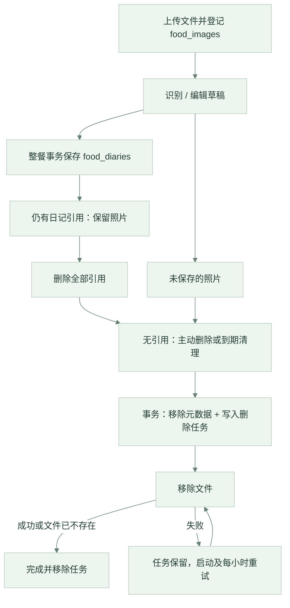

# 数据管理与恢复

核对日期：2026-09-18；代码基线为 `f72677b`。本文说明当前实现、已启用的运维措施与剩余缺口。部署命令见[云端运维](../deploy/cloud/README.md)，接口字段见 [Go API](../backend/API.md)。

## 数据存放与保留

| 数据 | 位置 | 当前保留规则 |
|---|---|---|
| 账号、健康档案 | Go SQLite：`users`、`user_profiles` | 没有自动到期清理；尚无账号注销或完整导出接口 |
| 饮食明细 | Go SQLite：`food_diaries` | 保留至用户删除；不会在第 8 天聚合后删除 |
| 历史汇总基数 | Go SQLite：`daily_summaries` | 兼容旧版已聚合数据，不再通过删除明细生成新基数 |
| 整餐提交回执 | Go SQLite：`diet_batches` | 保存请求摘要和原始响应，目前没有过期清理 |
| 照片元数据及文件 | Go SQLite：`food_images`；uploads 卷 | 被日记引用时保留；未引用照片默认在上传满 7 天后清理 |
| 待删除文件任务 | Go SQLite：`image_deletions` | 文件移除成功后删除任务；失败持续重试 |
| 刷新令牌、吊销记录 | Go SQLite：`refresh_tokens`、`blacklisted_tokens` | 定期清理过期或已吊销项；刷新令牌存哈希 |
| AI 会话和消息 | Agent SQLite：`sessions` | 用户可删除自己的会话；没有统一自动保留期 |
| 照片分析缓存 | Agent 进程内存 | 有效期 1 小时，最多 500 项，重启丢失；缓存命中前仍检查图片归属 |
| 食物营养库、教材向量库、模型 | `nutrition.db`、`chroma_db/`、模型卷 | 版本化参考数据；与用户数据备份分开恢复 |
| 手机登录状态 | 按 API 地址隔离的 WebView localStorage | 持久化令牌与用户信息；健康档案只在内存，尚未使用 Keychain / Keystore |

汇总从现存明细实时计算，并叠加旧版本历史基数；编辑、补记、删除会影响对应日期的趋势。旧版已经删除的明细不能从汇总反推恢复。

**删除一条日记不等于清除所有副本**：它不会立即删除照片，不会重写整餐提交回执，也不会修改历史备份。回执仍可能包含已修改或删除记录的原始字段。会话、照片、回执和备份的统一擦除策略尚待实现。

## 照片的完整生命周期

1. App 解码并压缩照片，上传到 Go。Go 嗅探实际 MIME，只接受 JPEG / PNG / WebP，单图上限 10 MiB、完整 multipart 请求上限 11 MiB。
2. Go 使用 UUID 文件名及按 MIME 确定的扩展名，写入权限为 `0600` 的文件。文件同步和关闭后才登记元数据；正常失败路径会移除未登记文件。
3. Agent 通过 JWT 确定用户，从 Go 查图片归属，再读取图片。当前照片分析会将照片发给 DeepSeek 官方接口；API Key 留在服务器。
4. 返回的食物、克重和营养值是待确认草稿。App 允许修改后，将最多 12 项通过 Go 单个事务保存；各条记录可引用同一张照片。
5. 有任一日记引用时，照片不会被定时清理，也不能直接删除。用户删除全部引用后，可调用图片删除接口，或等待未关联照片清理。

### 删除的一致性

[删除服务](../backend/internal/service/image_deletion.go)将“没有日记引用”的判断、元数据删除和删除任务入库放在同一事务中。事务失败时回滚，不先删文件。事务提交后才尝试物理删除：

| 结果 | HTTP | 含义 |
|---|---|---|
| 仍被日记引用 | `409` | 不删除元数据和文件 |
| 文件已删除或原本不存在 | `200` | 删除任务已完成 |
| 文件删除或任务收尾失败 | `202` | 元数据已删除，持久化任务等待后台重试 |
| 其他用户的照片 / 不存在 | `403` / `404` | 请求未获准或元数据不存在 |
| 数据库操作失败 | `500` | 不能把数据库失败当作删除成功 |

`202` 后再次 DELETE 可能因元数据已移除而返回 `404`，不代表清理任务丢失。任务会跨服务重启保留；批次处理避免少数失败任务阻塞后续任务。

### 定时清理与文件对账

[清理任务](../backend/internal/service/cleanup.go)在启动时和每小时执行：

- 重试 `image_deletions` 中的任务。
- 对账 uploads 顶层符合应用 UUID 命名的普通文件：超过 24 小时，且既没有元数据也没有待删除任务时才清理。不跟随符号链接，不处理未知名称或近期文件；数据库查询失败就停止该轮对账。
- 清理上传满 `UNATTACHED_IMAGE_RETENTION_DAYS` 且无日记引用的照片，默认 7 天。计时基准是上传时间，**不是最后一次解除引用时间**；老照片解除引用后可能在下一轮清理中到期。

设置 `UNATTACHED_IMAGE_RETENTION_DAYS=0` 只关闭第三项的到期清理，不关闭持久化删除重试和未登记文件对账。

## 整餐保存与错误处理

`POST /api/diet/logs/batch` 使用用户 ID 和 `request_id` 唯一约束防重。首次保存返回 `201`；同一 ID、相同规范化内容重试返回 `200` 和原始回执；相同 ID、不同内容返回 `409`。记录和回执一起提交，任何一项失败则整批回滚。

App 在结果不确定时保留原始提交并用相同 UUID 重试。手动单条新增等其他写操作尚未全部实现幂等保护。回执代表首次提交结果，不能用它替代后续日记查询。

档案查询只在明确“尚无档案”时返回空档案；数据库故障返回服务错误。保存前读取失败也不会被当作“需要创建新档案”。用户应看到加载或保存失败，而不是被误导为数据为空。

## 备份范围与恢复边界

[备份程序](../deploy/cloud/backup/backup.py)通过 SQLite 在线备份 API 分别快照 Go / Agent 数据库，再复制 Go 快照中 `food_images` 引用的图片。它生成哈希清单、检查 SQLite 完整性及表计数，每次创建备份后都在隔离目录实际恢复并校验。

- 默认保留最近 **14 份成功快照**；这不是严格的 14 天保留期。
- 两个数据库分别一致，但不保证跨库处于同一时刻；需要跨库同刻一致时应先暂停写入。
- 不包含模型卷、教材向量卷、TLS 状态、部署 `.env` 或其他密钥。参考数据从仓库和固定模型版本恢复，密钥需要另行保管。
- 隔离恢复验证不会覆盖生产。生产恢复须停写，保全当前数据，再选择整份快照切换，详见[恢复流程](../deploy/cloud/README.md#自动备份与恢复验证)。
- 本机快照可以应对误改和部分应用故障，不能应对整机或整盘损失。

## 检测、异地存储与通知

[运维编排](../deploy/cloud/backup/operations.py)使用主机 `/etc/nutrigo/backup.json`，模板为 [operations.example.json](../deploy/cloud/backup/operations.example.json)。

| 配置 | 默认值 / 行为 |
|---|---|
| `keep` | 14；编排入口的本地快照保留份数 |
| `max_age_hours` | 36；最新快照超过该年龄报错 |
| `min_free_bytes` / `max_used_percent` | 2 GiB / 90%；检查项目和配置的磁盘路径 |
| `remote` | 空；配置独立存储的 rclone remote 后才复制 |
| `rclone_config` | `/etc/nutrigo/rclone.conf`；凭据不提交 Git |
| `alert_webhook` | 空；配置 HTTPS 接收地址后才发送故障和恢复通知 |

启用异地存储时，顺序为本地备份、校验、`rclone copy --immutable`、`check --download` 读回校验、登记成功，最后才清理旧本地备份。远端失败保留本地旧快照；下一次调度生成并复制新的完整快照，不会自动补传所有旧的失败快照。脚本不删除远端历史，远端保留期由存储端设置。

截至本次核对，服务器已启用每日 03:30（Asia/Shanghai，允许约 5 分钟随机延迟）的备份与每小时检测；**尚无异地存储，`remote` 和通知入口均未启用**。结果写入 `backups/maintenance-status.json` 和 systemd 日志。没有通知接收地址就不会主动推送，主机彻底不可用也需要独立的外部监控发现。

已配置 webhook 时，相同故障会去重，恢复通知一次；通知投递失败会在后续检测重试。不要把“检测脚本存在”理解为已经收到异地通知或已经具备整机容灾。

## 后续完善

目前仍缺少统一账号注销与导出、跨会话/回执/备份的删除政策、数据库版本化迁移、用户存储配额、原生安全凭据存储和离线同步。异地存储、通知接收端及外部监控需要真实资源接入；完成接入后还应演练从独立环境完整恢复。优先级见[路线图](ROADMAP.md)。
