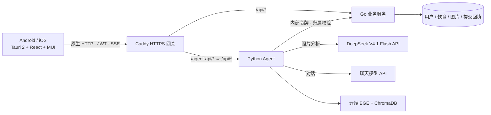

# NutriGo 手机 App

NutriGo 使用 **Tauri 2 + React 19 + MUI 9** 构建 Android 和 iOS App。React 页面随安装包分发，手机通过 HTTPS 访问云端 Go / Python 服务；模型 API 由服务器调用，本地检索模型、密钥和数据库留在云端。浏览器与 Vite 用于开发预览。

当前已发布 [Android 0.1.6 ARM64 测试版](https://github.com/Green-hats/NutriGo/releases/tag/android-v0.1.6)，约 16.1 MiB；可覆盖此前同签名的 Release 版本。iOS 已有原生工程和 CI 检查，尚未发布 IPA / TestFlight。



## 开发环境

公共依赖：Node.js 22.12+、Rust stable；本地后端仍需 Go 和 Python。Android 需 Android Studio、SDK 36、NDK、JDK 21；iOS 需 macOS、Xcode、XcodeGen、CocoaPods。具体安装步骤见 [Tauri 官方前置要求](https://v2.tauri.app/start/prerequisites/)。

```bash
cd frontend
npm ci
```

`src-tauri/gen/android` 和 `src-tauri/gen/apple` 是原生项目源码，提交到仓库；机器路径、签名、缓存和构建产物不提交。工程已存在时不需要重复运行初始化，避免覆盖原生配置。首次在新平台配置工具链时，按 CLI 提示安装 Rust 目标。

Android 环境变量示例（路径按本机调整）：

```bash
export JAVA_HOME="$(/usr/libexec/java_home -v 21)"
export ANDROID_HOME="$HOME/Library/Android/sdk"
export NDK_HOME="$ANDROID_HOME/ndk/<已安装版本>"
rustup target add aarch64-linux-android
```

iOS Apple Silicon 模拟器与真机目标：

```bash
rustup target add aarch64-apple-ios aarch64-apple-ios-sim
```

## 本地运行

按根目录 README 配置并启动 Go `:3333` 和 Agent `:8000`。手机开发模式可以通过开发机的 Vite 代理访问这两个服务：

```bash
cd frontend
npm run android:dev
# 或在 macOS 上
npm run ios:dev
```

Tauri 会启动 Vite，不要同时占用 5173 端口。真机和开发机应处于同一局域网；CLI 设置的 `TAURI_DEV_HOST` 用于 Vite 监听与热更新。防火墙允许开发机 5173 / 5174，不需要把本地数据库服务暴露到公网。

也可以 `npm run dev` 在浏览器预览，或 `npm run app:dev` 在桌面窗口检查。默认空 `VITE_API_BASE_URL` 让开发请求走 Vite 的 `/api`、`/agent-api` 代理。开发配置允许 HTTP；正式配置仅允许 HTTPS。

## 连接云端与打包

尚无域名时，可以先完成本地开发。云端配置参见 [部署说明](../deploy/cloud/README.md)。取得域名后，在 `frontend/.env.production.local` 中填写：

```dotenv
VITE_API_BASE_URL=https://api.your-domain.com
```

这里只写源地址，不带 `/api`、查询参数、凭据或路径。`VITE_*` 会写入客户端安装包，**只能放公开配置**；JWT 签名密钥、内部令牌和 LLM Key 不得放入。修改域名后需要重新打包。

同时将 `src-tauri/capabilities/default.json` 的 `https://*/*` 收窄为实际的 `https://api.your-domain.com/*`。当前通配范围用于域名尚未确定的模板，应用代码只请求构建时配置的服务器。

```bash
cd frontend
# 校验 HTTPS 地址并构建 React 资源
npm run build:app
# Android：默认生成发布构建，按 CLI 参数选择 APK / AAB
npm run android:build -- --target aarch64
# iOS：在 macOS / Xcode 环境中构建
npm run ios:build
```

`build:app` 在缺少地址或使用 HTTP 时会失败。CI 的 `https://api.example.com` 只是编译验证占位符，不能用于真实登录。

Android 发布需要配置自己的 keystore；iOS 真机／分发需要 Apple 开发团队和签名，在本机设置 `APPLE_DEVELOPMENT_TEAM` 或 Xcode Signing。当前标识符为 `com.greenhats.nutrigo`，上线前可在 Tauri 配置与原生项目中统一修改。Android 最低版本为 8.0（API 26），iOS 最低版本为 17.0（已同步到 Tauri、Xcode 和 CocoaPods 配置）。Android 设备还需使用 Chromium 117 或更新的 Android System WebView；系统版本满足要求并不保证 WebView 版本满足要求。

### 精简版 Android 测试包

GitHub Release 和 CI 的 ARM64 测试包使用以下命令：

```bash
cd frontend
VITE_API_BASE_URL=https://你的API地址 npm run android:compact -- --ci
```

脚本先清理 Android app 构建目录，避免增量 ZIP 打包留下大块空白，再对 Rust 启用体积优化、Thin LTO、单代码生成单元并移除符号。仅这次打包覆盖 Cargo 开发配置，日常 `android:dev` 保留调试体验；未改变 panic、断言和溢出检查行为。编译选项参考 [Cargo profiles](https://doc.rust-lang.org/cargo/reference/profiles.html)。线上包与离线预览包均有 **20 MiB** 体积上限，超限会使构建和 CI 失败。

为了覆盖已有测试版，精简包仍使用 `com.greenhats.nutrigo.debug` 和原有 Android debug 签名。Release 工作流会使用仓库 Secrets 中保存的同一 keystore 重新签署 CI 产物，并检查证书指纹。普通 CI Artifacts 使用临时调试签名，更新手机上的 Release 版本时请下载 Release 附件。它仍是测试包，商店发布继续使用上面的正式构建与独立发布签名。

### 自动发布 GitHub Release

工作流入口：[Actions → Android Release](https://github.com/Green-hats/NutriGo/actions/workflows/android-release.yml)。

1. 更新 `src-tauri/tauri.conf.json`、`src-tauri/Cargo.toml` 和 `src-tauri/Cargo.lock` 中 NutriGo 的版本号，提交到 `main`。当前 `0.1.6` 对应 Android versionCode `1006`，下一次发版须使用新版本号。
2. 在该工作流页面点击 **Run workflow**，选择 **main**；或推送与新版本一致的 `android-v<版本号>` 标签。两种方式选择一种即可。
3. 工作流复用完整 CI，通过后下载同一次运行的联网 APK，使用固定签名签署，并校验包名、版本、ARM64 架构、签名指纹、ZIP 完整性、16 KB 对齐和 20 MiB 体积上限。
4. 自动创建 `android-v<版本号>` 的预发布 Release，上传 APK、`SHA256SUMS.txt`、`release-manifest.json`。先上传到草稿并核对 GitHub 返回的校验值，全部一致后才公开。说明包含源码提交、安装要求和 CI 链接。

手动发布仅允许 `main`；标签版本必须与源码一致，提交必须已进入 `main`。已公开的 Release 不会被覆盖，已有标签不会被移动；上传中断时可重跑同一提交，继续它自己的草稿。升级签名不匹配、未配置真实 HTTPS 地址或任意 CI 失败都会阻止发布。

仓库 **Settings → Secrets and variables → Actions** 需要以下配置：

| 类型 | 名称 | 用途 |
|---|---|---|
| Variable | `NUTRIGO_API_BASE_URL` | 实际云端 HTTPS 源地址；发布不接受示例占位地址 |
| Variable | `ANDROID_SIGNING_CERT_SHA256` | 已发布 APK 的签名证书 SHA-256，64 位十六进制 |
| Secret | `ANDROID_KEYSTORE_BASE64` | 现有 keystore 的 Base64 内容 |
| Secret | `ANDROID_KEYSTORE_PASSWORD` | keystore 密码 |
| Secret | `ANDROID_KEY_ALIAS` | 签名密钥别名 |
| Secret | `ANDROID_KEY_PASSWORD` | 签名密钥密码 |

不要重新生成已有应用的签名密钥，也不要把 keystore 或密码提交到 Git。签名仅在全部 CI 通过后的发布任务使用，临时 keystore 在签署结束后删除；只有发布任务申请 `contents: write` 权限。iOS 当前仍做原生检查，此流程只发布 Android APK。

界面使用 MUI 9 + Emotion 和本地系统字体，不需要在线字体服务。构建目标为 Safari 17 / Chrome 117，依据 [MUI 浏览器支持范围](https://mui.com/material-ui/getting-started/supported-platforms/)。

## 移动端实现

| 模块 | 实现 |
|---|---|
| 页面导航 | HashRouter；页面打包本地，保留对话、日记、我的三个入口 |
| 网络 | `api/config.ts` 统一地址；`api/http.ts` 在原生环境使用 Tauri HTTP 插件，浏览器用 fetch |
| 流式对话 | 原生 ReadableStream 解析 SSE；支持停止、重新生成、401 刷新与断线提示 |
| 手机布局 | 安全区、动态可视高度、键盘弹出时隐藏底部导航；中文输入法回车不会误发送 |
| 食物照片 | 独立拍照／相册入口；系统文件选择器；JPEG 转换、长边 1600px、上传上限 10MB |
| 登录状态 | 按服务器地址隔离本地存储；切换账号清空对话；健康档案不持久化到客户端 |
| 档案输入 | 年龄使用整数键盘，0–150 的整数校验失败时在输入处提示并阻止保存；身高、体重保留小数输入，年龄留空仍可保存其他信息 |

照片由 WebView 解码并压缩；无法解码的 HEIC 等文件会提示改选 JPG、PNG 或 WebP。Android 使用系统相机 Intent 和 FileProvider；iOS 提供相机、相册及局域网权限说明。拍照、系统返回键、键盘和权限拒绝行为仍需在目标真机上验收。

Android 的 WebView 延伸到透明状态栏和导航栏下方，页面背景铺满窗口。原生层通过只读 `NutriGoInsets.getInsets()` 提供系统栏／刘海尺寸和键盘状态，前端按设备像素比转为 CSS 安全区，只给内容和操作控件留出空间；原生容器仅为键盘缩小高度。传给 WebView 的系统栏、刘海和键盘 insets 清零，避免新版 WebView 重复计算；旧版 WebView 也能使用这套显式尺寸。键盘关闭、横竖屏切换时同步更新。iOS 继续使用 CSS `env(safe-area-inset-*)`。处理原则参见 [Android 官方 WebView insets 文档](https://developer.android.com/develop/ui/views/layout/webapps/understand-window-insets)。

当前登录令牌保存在应用 WebView 的 localStorage，并未实现 Keychain / Keystore 加密持久化。当前版本为在线应用，没有离线同步、后台持续生成或系统推送；切离对话页面会取消当前流。

## 验证

```bash
cd frontend
npm run test
npm run lint
VITE_API_BASE_URL=https://api.example.com npm run build:app
cargo check --locked --manifest-path src-tauri/Cargo.toml
```

发布前在 Android / iOS 真机检查：注册登录和刷新令牌、拍照与相册上传、识别后保存日记、对话停止与重试、软键盘遮挡、刘海安全区、退出登录后切换账号。照片分析需要服务端 DeepSeek 配置；RAG 需要部署仓库中的向量库快照及匹配的 BGE 模型，准备步骤见 [云端部署](../deploy/cloud/README.md)。

若 Xcode 报 `iOS ... is not installed` 或 `Found no destinations`，在 **Xcode → Settings → Components** 安装对应 iOS 平台及模拟器运行时后再运行。工程生成或 Rust 检查通过不等于已完成真机验收。

### 早期迁移记录（2026-09-16，非当前交付状态）

- 53 个前端测试、TypeScript 生产构建和 oxlint 通过。
- macOS 原生检查、iOS ARM64 `cargo check` 通过。
- Android ARM64 调试 APK 打包通过，产物位于 `src-tauri/gen/android/app/build/outputs/apk/universal/debug/app-universal-debug.apk`。
- 使用本地模拟 API 检查 320px / 390px 布局、注册登录、SSE、JPEG 压缩上传与退出登录。此项不等于真实模型识别验收。
- 云端 Compose 校验、Caddy 路由／内部接口阻断／SSE 首包测试通过；未运行完整云端容器或部署服务器。
- iOS 完整打包受本机未安装 iOS 26.5 平台影响，未生成 IPA。双端真机验收和发布签名尚未完成。

上述早期本地测试 APK 使用 `https://api.example.com` 占位地址，只用于打包检查；当前 Release 已配置实际云端 HTTPS 地址。

## MUI 界面更新（2026-09-16）

- MUI 9 + Emotion 替换 Tailwind / Lucide，统一登录、对话、日记、档案、趋势、会话抽屉和通知样式。
- 本地通过前端 82 项测试、类型检查、lint 和生产 App 构建；依赖审计为 0 个漏洞。
- 使用本地模拟数据验证登录、对话、相册选图→识别→调整份量→保存、趋势切换、档案保存及会话删除确认；检查 320px / 390px 手机布局与缩短可视高度时的输入框位置。仓库截图使用模拟数据。
- 浏览器预览验证不替代 Android / iOS 真机验收；当前 API 域名仍按部署配置提供。

## 离线界面体验 APK

没有云端地址时，可以单独构建只读的体验包：

```bash
cd frontend
npm run android:preview -- --ci
```

沿用上文 Java / Android SDK / NDK 环境。APK 位于 `src-tauri/gen/android/app/build/outputs/apk/universal/debug/app-universal-debug.apk`；Android ARM64 调试签名，可直接安装。CI 同时验证正常 App 构建与体验包构建，并在运行页面的 Artifacts 提供 `NutriGo-preview-arm64.apk`，保留 14 天，下载需登录 GitHub。本机构建包与 CI 包的调试签名可能不同，更新时应使用同一来源的包。

安装后点击「离线界面体验（免登录）」。可浏览真实页面布局、示例饮食数据和趋势，查看示例历史会话，填写档案、测试键盘和相册选图。照片仅在本机预览。示例模式不产生登录令牌、不访问云端、不保存修改，也不生成 AI 回复。入口只出现在 `--mode preview` 且 `VITE_ENABLE_PREVIEW=true` 的独立构建中，正常生产构建不能进入此模式。

联网版的异常提示：

- 系统报告断网时，显示持续的中文提示；恢复网络后提醒手动重试，不自动重发写操作。
- 服务器不可达、超时、服务临时故障分别提示，不误报为没有记录。
- 普通请求连接及响应体等待最长 20 秒，AI 请求和流式回复空闲等待最长 60 秒；连续收到回复会重置计时。
- 刷新令牌遇断网、超时、503 或限流会保留登录态，凭证确实失效才要求重新登录。
- 保存失败保留当前表单；不会显示保存成功。照片整餐提交通过 UUID 防重，超时后锁定原提交并允许重试；手动记录等其他写操作需先核对服务器是否已保存。当前不提供离线缓存、离线 AI 或自动同步。

云端 API 部署完成后，可以设置 GitHub 仓库 Actions 变量 `NUTRIGO_API_BASE_URL` 为实际 HTTPS 源地址。CI 会额外保留 `NutriGo-online-arm64.apk`，供连接云端服务的实机测试；未配置时仅上传离线预览包。两者都是调试签名，不能作为商店发布包。

## 0.1.6 照片分析与餐次选择

拍照后用 DeepSeek V4.1 Flash（`deepseek-flash`）生成多项食物草稿，克重和热量均可修正；确认才写入日记。服务端必须先上线 `/agent-api/analyze-meal` 和 `/api/diet/logs/batch`，再安装新 APK。旧 APK 仍使用 CLIP 候选流程。API Key 只在服务器，照片会由服务器提交至 DeepSeek 官方；离线体验包不会上传。

记录入口按手机本地时间预选餐次，用户直接点击早餐、午餐、晚餐或加餐修改；选择会贯穿识别、确认和转手动录入，不因时间变化而重置。界面统一为“记录这一餐”，移除重新按时间选择按钮、半份按钮及重复说明；估重范围、假设和每 100g 营养收纳在“营养详情”。整餐通过一个事务保存，相同提交重试返回原结果。
