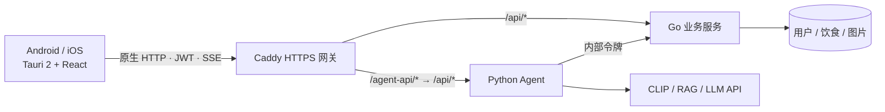

# NutriGo 手机 App

NutriGo 使用 **Tauri 2 + React 19 + MUI 9** 构建 Android 和 iOS 安装包。React 页面随安装包分发，手机通过 HTTPS 访问云端 Go / Python 服务；AI 模型、LLM 密钥和数据库保留在服务器。浏览器与 Vite 仅用于开发预览，不需要部署前端站点。



## 开发环境

公共依赖：Node.js 22.12+、Rust stable；本地后端仍需 Go 和 Python。Android 需 Android Studio、SDK 36、NDK、JDK 21；iOS 需 macOS、Xcode、XcodeGen、CocoaPods。具体安装步骤见 [Tauri 官方前置要求](https://v2.tauri.app/start/prerequisites/)。

```bash
cd frontend
npm ci
```

`src-tauri/gen/android` 和 `src-tauri/gen/apple` 是原生项目源码，提交到仓库；机器路径、签名、缓存和构建产物不提交。工程已存在时不需要重复运行初始化，避免覆盖原生配置。首次在新平台配置工具链时，按 CLI 提示安装 Rust 目标。

Android 环境变量示例（路径按本机调整）：

```bash
export JAVA_HOME="$(/usr/libexec/java_home -v 21)"
export ANDROID_HOME="$HOME/Library/Android/sdk"
export NDK_HOME="$ANDROID_HOME/ndk/<已安装版本>"
rustup target add aarch64-linux-android
```

iOS Apple Silicon 模拟器与真机目标：

```bash
rustup target add aarch64-apple-ios aarch64-apple-ios-sim
```

## 本地运行

按根目录 README 配置并启动 Go `:3333` 和 Agent `:8000`。手机开发模式可以通过开发机的 Vite 代理访问这两个服务：

```bash
cd frontend
npm run android:dev
# 或在 macOS 上
npm run ios:dev
```

Tauri 会启动 Vite，不要同时占用 5173 端口。真机和开发机应处于同一局域网；CLI 设置的 `TAURI_DEV_HOST` 用于 Vite 监听与热更新。防火墙允许开发机 5173 / 5174，不需要把本地数据库服务暴露到公网。

也可以 `npm run dev` 在浏览器预览，或 `npm run app:dev` 在桌面窗口检查。默认空 `VITE_API_BASE_URL` 让开发请求走 Vite 的 `/api`、`/agent-api` 代理。开发配置允许 HTTP；正式配置仅允许 HTTPS。

## 连接云端与打包

尚无域名时，可以先完成本地开发。云端配置参见 [部署说明](../deploy/cloud/README.md)。取得域名后，在 `frontend/.env.production.local` 中填写：

```dotenv
VITE_API_BASE_URL=https://api.your-domain.com
```

这里只写源地址，不带 `/api`、查询参数、凭据或路径。`VITE_*` 会写入客户端安装包，**只能放公开配置**；JWT 签名密钥、内部令牌和 LLM Key 不得放入。修改域名后需要重新打包。

同时将 `src-tauri/capabilities/default.json` 的 `https://*/*` 收窄为实际的 `https://api.your-domain.com/*`。当前通配范围用于域名尚未确定的模板，应用代码只请求构建时配置的服务器。

```bash
cd frontend
# 校验 HTTPS 地址并构建 React 资源
npm run build:app
# Android：默认生成发布构建，按 CLI 参数选择 APK / AAB
npm run android:build -- --target aarch64
# iOS：在 macOS / Xcode 环境中构建
npm run ios:build
```

`build:app` 在缺少地址或使用 HTTP 时会失败。CI 的 `https://api.example.com` 只是编译验证占位符，不能用于真实登录。

Android 发布需要配置自己的 keystore；iOS 真机／分发需要 Apple 开发团队和签名，在本机设置 `APPLE_DEVELOPMENT_TEAM` 或 Xcode Signing。当前标识符为 `com.greenhats.nutrigo`，上线前可在 Tauri 配置与原生项目中统一修改。Android 最低版本为 8.0（API 26），iOS 最低版本为 17.0（已同步到 Tauri、Xcode 和 CocoaPods 配置）。Android 设备还需使用 Chromium 117 或更新的 Android System WebView；系统版本满足要求并不保证 WebView 版本满足要求。

界面使用 MUI 9 + Emotion 和本地系统字体，不需要在线字体服务。构建目标为 Safari 17 / Chrome 117，依据 [MUI 浏览器支持范围](https://mui.com/material-ui/getting-started/supported-platforms/)。

## 移动端实现

| 模块 | 实现 |
|---|---|
| 页面导航 | HashRouter；页面打包本地，保留对话、日记、我的三个入口 |
| 网络 | `api/config.ts` 统一地址；`api/http.ts` 在原生环境使用 Tauri HTTP 插件，浏览器用 fetch |
| 流式对话 | 原生 ReadableStream 解析 SSE；支持停止、重新生成、401 刷新与断线提示 |
| 手机布局 | 安全区、动态可视高度、键盘弹出时隐藏底部导航；中文输入法回车不会误发送 |
| 食物照片 | 独立拍照／相册入口；系统文件选择器；JPEG 转换、长边 1600px、上传上限 10MB |
| 登录状态 | 按服务器地址隔离本地存储；切换账号清空对话；健康档案不持久化到客户端 |

照片由 WebView 解码并压缩；无法解码的 HEIC 等文件会提示改选 JPG、PNG 或 WebP。Android 使用系统相机 Intent 和 FileProvider；iOS 提供相机、相册及局域网权限说明。拍照、系统返回键、键盘和权限拒绝行为仍需在目标真机上验收。

Android 在原生容器处理系统栏、刘海与键盘空间，再清零已处理的 insets 传给 WebView，避免旧版 WebView 遮挡内容或新版重复留白；iOS 使用 CSS 安全区。做法依据 [Android 官方 WebView insets 文档](https://developer.android.com/develop/ui/views/layout/webapps/understand-window-insets)。

当前登录令牌保存在应用 WebView 的 localStorage，并未实现 Keychain / Keystore 加密持久化。当前版本为在线应用，没有离线同步、后台持续生成或系统推送；切离对话页面会取消当前流。

## 验证

```bash
cd frontend
npm run test
npm run lint
VITE_API_BASE_URL=https://api.example.com npm run build:app
cargo check --locked --manifest-path src-tauri/Cargo.toml
```

发布前在 Android / iOS 真机检查：注册登录和刷新令牌、拍照与相册上传、识别后保存日记、对话停止与重试、软键盘遮挡、刘海安全区、退出登录后切换账号。识别与 RAG 验收需要服务器上的对应模型和数据；此次迁移不补充尚未上传的 RAG 数据。

若 Xcode 报 `iOS ... is not installed` 或 `Found no destinations`，在 **Xcode → Settings → Components** 安装对应 iOS 平台及模拟器运行时后再运行。工程生成或 Rust 检查通过不等于已完成真机验收。

### 本次迁移验证（2026-09-16）

- 53 个前端测试、TypeScript 生产构建和 oxlint 通过。
- macOS 原生检查、iOS ARM64 `cargo check` 通过。
- Android ARM64 调试 APK 打包通过，产物位于 `src-tauri/gen/android/app/build/outputs/apk/universal/debug/app-universal-debug.apk`。
- 使用本地模拟 API 检查 320px / 390px 布局、注册登录、SSE、JPEG 压缩上传与退出登录。此项不等于真实模型识别验收。
- 云端 Compose 校验、Caddy 路由／内部接口阻断／SSE 首包测试通过；未运行完整云端容器或部署服务器。
- iOS 完整打包受本机未安装 iOS 26.5 平台影响，未生成 IPA。双端真机验收和发布签名尚未完成。

本地测试 APK 使用 `https://api.example.com` 占位地址，只用于打包检查。连接真实服务前请填写自己的 API 地址并重新打包。

## MUI 界面更新（2026-09-16）

- MUI 9 + Emotion 替换 Tailwind / Lucide，统一登录、对话、日记、档案、趋势、会话抽屉和通知样式。
- 本地通过前端 82 项测试、类型检查、lint 和生产 App 构建；依赖审计为 0 个漏洞。
- 使用本地模拟数据验证登录、对话、相册选图→识别→调整份量→保存、趋势切换、档案保存及会话删除确认；检查 320px / 390px 手机布局与缩短可视高度时的输入框位置。仓库截图使用模拟数据。
- 浏览器预览验证不替代 Android / iOS 真机验收；当前 API 域名仍按部署配置提供。
