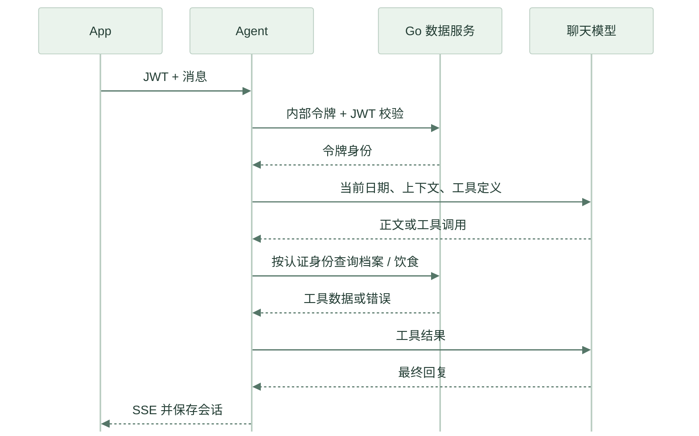

# Python Agent

核对日期：2026-09-18。FastAPI 服务运行于 `8000`，负责聊天工具编排、照片营养草稿和 RAG 检索。生产通过 Caddy 的 `/agent-api/*` 进入，转发为 Agent 的 `/api/*`。用户数据由 Go 管理，聊天历史由 Agent 的 SQLite 保存。

## 启动与配置

```bash
cd agent
cp .env.example .env
# 编辑 .env，填入所选聊天供应商的模型、地址和密钥
uv sync --group dev
LITELLM_LOCAL_MODEL_COST_MAP=true uv run uvicorn app.main:app --port 8000
```

配置优先以实际环境变量和 [config.py](../agent/app/config.py) 为准；本地 [.env.example](../agent/.env.example) 与[云端模板](../deploy/cloud/.env.example)提供不同聊天供应商示例，不能混用它们的 Key、模型名和地址。代码缺省值不是已验证的供应商可用模型清单。

| 配置 | 作用 |
|---|---|
| `LLM_MODEL`、`LLM_API_KEY`、`LLM_BASE_URL` | LiteLLM 聊天供应商、模型及服务端凭据；自定义地址按供应商配置 |
| `FOOD_VISION_MODEL` | 当前照片流程配置为 `deepseek-flash`，项目中称 DeepSeek V4.1 Flash |
| `FOOD_VISION_API_KEY` | DeepSeek 官方照片分析 Key；留空时仅允许复用 DeepSeek 官方聊天配置的 Key |
| `GO_BACKEND_URL`、`INTERNAL_TOKEN`、`JWT_SECRET` | Go 地址、内部鉴权和双方一致的 JWT 密钥 |
| `APP_TIMEZONE` | AI 相对日期的业务时区，默认 `Asia/Shanghai` |
| `AI_ENABLED`、`RAG_ENABLED`、`FOOD_RECOGNITION_ENABLED` | AI、知识库、照片相关功能开关 |
| `RAG_MODEL_PATH` | BGE 模型标识或已准备的绝对目录；本地目录只从磁盘加载 |
| `FOOD_MODEL_PATH`、`FOOD_MODEL_PRELOAD`、`FOOD_MODEL_INT8` | 旧版 CLIP 兼容接口的模型与预热 / 量化选项 |
| `DATABASE_PATH` | 会话数据库路径，默认 `agent.db` |
| `CHAT_TIMEOUT` | 整次聊天生成的总超时，默认 300 秒，包含模型流式读取、工具调用和保存 |

当前照片请求在 [meal.py](../agent/recognition/meal.py) 中固定发往 `https://api.deepseek.com/chat/completions`，不会把第三方聊天代理 Key 自动发送到该地址。模型是否可用应以实际供应商响应验收，配置字符串本身不能证明开通了相应能力。

生产应先准备并校验模型和知识库快照，避免依赖首次启动自动下载；流程见[云端部署](../deploy/cloud/README.md)。没有 AI Key 时可以关闭 AI，保留账号、日记等基础功能。`health` / `ready` 正常不代表 RAG 或模型推理已经通过验收。

## 源码分工

普通请求体在解析前限制为 64 KiB/15 秒；照片分析通过 `app/photo_jobs.py` 共享用户和全局名额，旧 CLIP 额外限制 1 个在途任务。取消或响应超时不会提前释放仍运行的线程名额，详见[请求与资源限制](RESOURCE_LIMITS.md)。

| 文件 | 职责 |
|---|---|
| [app/main.py](../agent/app/main.py) | 服务初始化、聊天、会话、旧识别接口与探针 |
| [app/auth.py](../agent/app/auth.py) | 本地 JWT 验签并请求 Go 检查令牌状态 |
| [app/llm_client.py](../agent/app/llm_client.py) | Agent Loop、流式输出、工具执行、超时和重试 |
| [app/chat_stream.py](../agent/app/chat_stream.py)、[app/chat_io.py](../agent/app/chat_io.py) | SSE 阻塞队列、空闲心跳、生成总超时和断线资源回收 |
| [app/conversation.py](../agent/app/conversation.py)、[app/db.py](../agent/app/db.py) | 上下文裁剪和按用户隔离的会话持久化 |
| [app/tools.py](../agent/app/tools.py) | 工具注册、身份绑定与结果处理 |
| [app/meal_analysis.py](../agent/app/meal_analysis.py) | 照片归属、并发限制和短期缓存 |
| [recognition/meal.py](../agent/recognition/meal.py) | DeepSeek 请求、JSON 草稿校验与营养库精确匹配 |
| [recognition/go_client.py](../agent/recognition/go_client.py) | 内部 Go HTTP 客户端 |
| [recognition/nutrition.py](../agent/recognition/nutrition.py)、[recognition/db.py](../agent/recognition/db.py) | 营养查询、摄入计算及用户数据工具 |
| [recognition/rag.py](../agent/recognition/rag.py) | BGE + ChromaDB 检索 |
| [recognition/multimodal.py](../agent/recognition/multimodal.py) | Chinese-CLIP 兼容流程 |

## HTTP 接口

下表为 Agent 服务内路径；App 将 `/api/` 前缀换成 `/agent-api/`。除两个探针外都要求 `Authorization: Bearer <JWT>`。

| 方法 | 路径 | 行为 |
|---|---|---|
| GET | `/api/health` | 进程健康 |
| GET | `/api/ready` | 会话数据库连接检查 |
| GET | `/api/chat?message=&session_id=` | SSE；不传会话 ID 时创建会话 |
| POST | `/api/sessions/:id/regenerate` | 重新生成最后一条回复，SSE |
| GET | `/api/sessions?limit=&offset=` | 分页会话列表，`items/total/limit/offset` |
| GET | `/api/sessions/:id` | 会话详情，仅本人 |
| PATCH | `/api/sessions/:id` | 重命名，JSON `{"name":"新名称"}` |
| DELETE | `/api/sessions/:id` | 删除会话 |
| POST | `/api/sessions/batch-delete` | JSON `{"ids":[1,2]}`，删除本人会话并返回 `deleted` |
| POST | `/api/analyze-meal` | JSON `{"image_id":42}`，返回可编辑的整餐草稿 |
| POST | `/api/identify-food` | 旧 APK 的 CLIP 候选识别 |
| POST | `/api/calculate-intake` | 旧流程按食物及克重计算摄入 |

Agent HTTP 错误沿用 FastAPI 的 `detail` 格式，与 Go 的 `{code,message}` 不同。SSE 已建立后还可能通过 `error` 事件报告错误。未授权返回 `401`；他人会话返回 `404`；Go 无法确认令牌状态时返回 `503`，不绕过鉴权。

照片接口示例响应：

```json
{
  "items": [{
    "name": "米饭",
    "grams": 150,
    "grams_low": 100,
    "grams_high": 220,
    "nutrition_per_100g": {"calories": 116, "protein_g": 2.6, "fat_g": 0.3, "carbs_g": 25.9},
    "assumption": "按普通饭碗估算，缺少尺寸参照",
    "nutrition_source": "database"
  }],
  "note": "请按实际吃下的份量调整克重。",
  "model": "deepseek-flash"
}
```

这是结构示例，不表示图片称重准确。模型可返回空 `items`，由 `note` 说明未识别到食物。重量限定 1–3000g 且落在给定范围内；每 100g 热量不超过 900kcal，宏量营养素各不超过 100g、合计不超过 105g；禁止非有限数值和额外字段。只有精确菜名命中且库值通过校验时才使用 `database`，其余标记 `model`。

照片读取前及缓存命中前均校验 Go 元数据归属。缓存 1 小时、最多 500 项，每用户同时 1 个分析、每进程最多 4 个。模型 HTTP 超时 45 秒，外部调用整体限定 48 秒；上游读取、归属核验和后续数据库处理还可能增加总接口耗时。超时返回 `504`，分析失败 `502`，并发超限 `429`，未配置 `409`。这些限制目前是单进程状态，不是分布式配额。

## 工具与对话

| 工具 | 数据源 | 用途 |
|---|---|---|
| `lookup_food_nutrition` | 8,407 条食物参考库 | 查询每 100g 营养 |
| `get_user_profile` | Go | 获取本人健康档案 |
| `get_diet_history` | Go | 获取指定日期饮食 |
| `get_diet_summary` | Go | 获取日期区间汇总和趋势 |
| `search_nutrition_knowledge` | ChromaDB | 检索《营养学》教材段落 |

用户身份来自 JWT，工具 schema 不要求模型提供用户 ID；执行时丢弃模型传入的身份字段，绑定经过认证的会话用户。Agent 本地验签之后还会请求 Go `/api/internal/auth/verify`，使登出吊销对 AI 接口生效。

系统提示词每次请求 LLM 前按 `APP_TIMEZONE` 刷新日期，旧会话和重新生成也使用当前业务日期；不修改历史消息原文。App 的餐次预选使用手机本地时间；目前尚未保存每用户业务时区，跨时区旅行时两者可能不同。



SSE 事件包括 `session_id`、`thinking`、`chunk`、`tool_call`、`tool_result`、`done`、`error`。`thinking` 只转发配置模型实际返回的 `reasoning_content`；没有该字段时正文和工具仍可正常运行，不能把缺少思考面板当作失败。

默认最多 15 轮 Agent 循环，单条消息最多 2,000 字符，上下文最多 40 条 / 8,000 token 预算，单次 LLM 超时 120 秒、工具超时 30 秒，同用户最多一个活跃对话。具体重试和上下文处理以配置及源码为准；用户停止或离开对话页面会取消流。

聊天和重新生成共用 `ChatStreamingResponse`：队列无消息时阻塞等待，不轮询 `Request.is_disconnected()`，由 Starlette 监听断线。空闲每 15 秒发送一次 SSE 注释心跳，客户端忽略注释；心跳不会重建队列读取任务或延长生成总期限。整次生成默认最多 300 秒（`CHAT_TIMEOUT`），覆盖模型连接、流式读取、工具和保存。模型异常、超时或未发送结束事件就返回时，发送友好的 `error` 事件并结束连接；供应商异常原文不发送到客户端。正常完成、客户端断开或发送失败都会取消并等待后台任务结束，释放用户并发名额。

## 知识库与兼容模型

仓库的 `agent/chroma_db/` 包含 `nutrition_textbook` 集合的 2,277 条教材文档；BGE-small-zh-v1.5 生成 512 维嵌入。工具取相关片段，默认检索 3 条并限制片段长度；针对明确的维生素名称增加正文匹配，减少维生素 C / D 等混淆。无匹配返回未找到，不能伪造出处。

目前返回片段与编号，尚无完整章节 / 页码溯源和系统化相关性评测；知识库载入不等于逐条专业审校或所有回答可靠。缺失、损坏或空知识库会降级；需要实际检索验证能力。

Docker 构建排除知识库快照，部署时须停 Agent 并完整复制 SQLite 与向量索引到 `chroma-data` 卷。模型版本必须匹配，不能只复制一个 SQLite 文件。参考数据与模型不包含在用户数据每日快照中，恢复边界见[数据管理](DATA_MANAGEMENT.md)。

Chinese-CLIP 继续支持调用旧识别接口的客户端；它输出菜名候选，不负责新流程的多食物估重。是否量化及预热由配置控制，不承诺固定识别延迟或准确率。

## 验证

```bash
cd agent
uv run pytest
uv run ruff check app/ recognition/ tests/
uv run mypy app/ recognition/
```

pytest 排除 `tests/integration/`，使用替身验证鉴权、工具身份、日期、流式输出、会话隔离、模型结果校验、缓存和失败处理，不以付费模型调用作为单测前提。

`tests/integration/` 脚本是开发联调辅助，部分使用固定测试用户和开发签名密钥，依赖独立 Go / Agent、模型或外部 LLM；运行前检查脚本配置，不能直接对生产执行。真实云端验收应注册测试账号并经 Go 登录取得令牌。提示词和人工判定标准见[测试清单](agent-test-prompts.md)，CI 与本地完整命令见[贡献指南](../CONTRIBUTING.zh-CN.md)。
