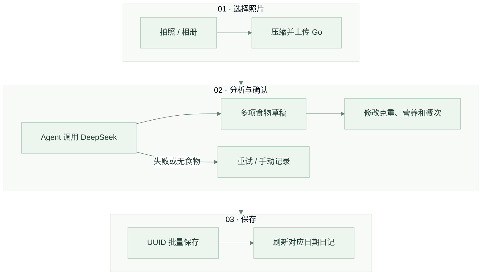

# 手机端界面与交互

核对日期：2026-09-20，Android 1.0.0 源码基线 `6ddfe4d3`。前端使用 **Tauri 2 + Rust + React 19 + TypeScript + Vite + MUI 9 + Emotion + Zustand**。页面和样式随安装包分发，浏览器 `:5173` 用于开发预览；Android / iOS 工具链、签名、兼容矩阵与 Release 见 [MOBILE.md](MOBILE.md)。

## 开发与结构

```bash
cd frontend
npm ci
npm run dev
# 配好原生工具链后可用 npm run android:dev 或 npm run ios:dev
```

Node.js 需 22.12+，CI 使用 Node.js 24。开发时 Vite 代理 Go 与 Agent，正式 App 通过 `VITE_API_BASE_URL` 访问 HTTPS 网关。该变量随包分发，只能放公开地址；服务器地址变更需要重新构建。

| 源码 | 职责 |
|---|---|
| [App.tsx](../frontend/src/App.tsx) | HashRouter、页面装配和通知 |
| [theme.ts](../frontend/src/theme.ts)、[index.css](../frontend/src/index.css) | MUI 主题、Markdown、移动端安全区 |
| [api/config.ts](../frontend/src/api/config.ts)、[api/http.ts](../frontend/src/api/http.ts) | API 地址、原生 HTTP / 浏览器 fetch 适配、超时与取消 |
| [api/authSession.ts](../frontend/src/api/authSession.ts) | 并发刷新、登录会话隔离、登出 |
| [api/sse.ts](../frontend/src/api/sse.ts) | 通过统一网络层解析流式事件 |
| [stores](../frontend/src/stores/) | 认证状态、会话和流式消息 |
| [components/chat](../frontend/src/components/chat/) | 历史抽屉、可展开工具详情 |
| [components/diary/MealAnalysisFlow.tsx](../frontend/src/components/diary/MealAnalysisFlow.tsx) | 照片分析、多项食物编辑和整餐提交 |
| [components/diary/DietRecordEditor.tsx](../frontend/src/components/diary/DietRecordEditor.tsx) | 手动记录和编辑 |
| [lib/meal.ts](../frontend/src/lib/meal.ts)、[lib/foodImage.ts](../frontend/src/lib/foodImage.ts) | 餐次默认值、照片预处理 |
| [lib/mobile.ts](../frontend/src/lib/mobile.ts) | 系统栏、键盘与可视窗口适配 |

## 页面与状态

| HashRouter 路径 | 功能 |
|---|---|
| `/login`、`/register` | 注册、登录 |
| `/chat` | SSE 对话、停止、重新生成、会话历史、工具详情 |
| `/diary` | 日期切换、照片或手动记录、编辑、删除、营养趋势 |
| `/profile` | 健康档案、目标、过敏原、基础病、登出 |

受保护页面需要登录。令牌、刷新令牌和用户信息按 API 地址隔离保存在 localStorage；档案仅放内存，尚未接入 Keychain / Keystore。账号切换会清理会话状态；旧请求的迟到响应不得写入新账号。

普通 API 和 SSE 都通过同一网络适配层：Tauri 环境使用原生 HTTP 插件，浏览器使用 fetch。并发 `401` 共用一次刷新，原请求最多自动重试一次；只有明确凭证失效才清除登录态，断网、限流或服务故障保留登录信息。

## 当前照片记录流程



当前入口是多模态整餐分析；旧版“CLIP 候选 → 选择菜名 → 调克数”的流程仅保留服务端兼容接口。

- 系统文件选择器负责拍照 / 相册入口。App 解码、转 JPEG、将长边缩至 1600px，并限制上传大小；无法解码时提示换用 JPG、PNG 或 WebP。
- 模型可返回最多 12 项食物。克重和营养可修改，估重范围、假设与每 100g 营养放在可展开详情中；照片分析结果不会自动写入日记。
- 餐次按手机本地时间预选：05:00–09:59 早餐，10:00–14:59 午餐，15:00–20:59 晚餐，其余为加餐。用户可直接修改，选择贯穿分析、确认及转手动录入。
- 保存使用单次 UUID 和完整草稿快照。结果不确定时保留原提交、锁定编辑并允许重试；同一提交由后端防重。明确修改为新的一餐应使用新提交。
- 日期使用日记当前选中日期；“记录这一餐”不会强制改回今天。照片清理和日记删除的关系见[数据管理](DATA_MANAGEMENT.md)。

## 日记与档案

手动记录填写日期、餐次、名称、份量及实际摄入总量的营养值，不依赖 AI。编辑采用完整字段更新；保存失败保留表单，删除需要确认。成功后重新查询对应日期；快速切换日期时忽略过期响应。

每日合计和趋势读取后端实时汇总。界面区分加载、空数据与错误，不把连接失败渲染成“没有记录”。趋势分别标示热量与克数，图表按需加载。

年龄输入接受 0–150 的整数，非法小数在输入处提示并阻止提交，留空可保存其他字段；身高体重允许小数。后端读取错误必须显示失败，不能用空档案覆盖已有信息。

## 对话与 Markdown

| SSE 事件 | 界面行为 |
|---|---|
| `session_id` | 绑定服务端会话 |
| `thinking` | 仅模型返回 `reasoning_content` 时显示折叠分析过程 |
| `chunk` | 追加正文，渲染 Markdown |
| `tool_call` | 展示工具处理中状态 |
| `tool_result` | 更新工具卡片并允许展开详情 |
| `done`、`error` | 结束流或显示错误 |

SSE 使用携带 Authorization 的 POST 请求流，不依赖浏览器 EventSource。消息和会话 ID 放在 JSON 请求体中，不出现在 URL 或访问日志。用户可以停止生成，离开页面会取消当前流；目前没有后台持续生成或系统推送。

饮食记录、档案和趋势工具卡片可展开查看具体数据。Markdown 禁用单个 `~` 的删除线识别，避免 `2200~2400` 这样的区间把中间文字划掉；标准 `~~删除线~~` 仍按 Markdown 渲染。模型分析面板是可选输出，不保证每个模型都会返回。

## 手机布局与网络体验

界面采用森林绿、暖白和统一圆角；底部保留对话、日记、我的三个入口，主要表单支持键盘和安全区。Android 原生层向 WebView 提供系统栏 / 刘海尺寸，背景铺满窗口，内容避让系统区域；iOS 使用 CSS 安全区。最低运行要求和真机验收边界见 [MOBILE.md](MOBILE.md)。

普通请求及响应体等待最长 20 秒，AI 请求和流式空闲等待最长 60 秒。持续收到流式内容会刷新空闲计时。系统报告断网时持续提示，网络恢复后让用户重试，不自动重发写操作。服务不可达、超时、暂时故障和凭证失效分别处理。

整餐照片保存已防重；其他写入超时仍需核对是否已保存。正常产品没有离线数据同步或离线 AI；独立 preview 包仅用于不联网的界面体验。

## 验证

```bash
cd frontend
npm run lint
npm test
npm run build
VITE_API_BASE_URL=https://api.example.com npm run build:app
```

单测覆盖认证隔离与刷新、网络超时、SSE、聊天、日记和整餐重试、档案校验、趋势、餐次以及安全区。原生工程由 CI 检查并构建 Android APK；浏览器测试不能替代 Android / iOS 的拍照、权限、返回键和软键盘真机验收。完整入口见[贡献指南](../CONTRIBUTING.zh-CN.md)。
